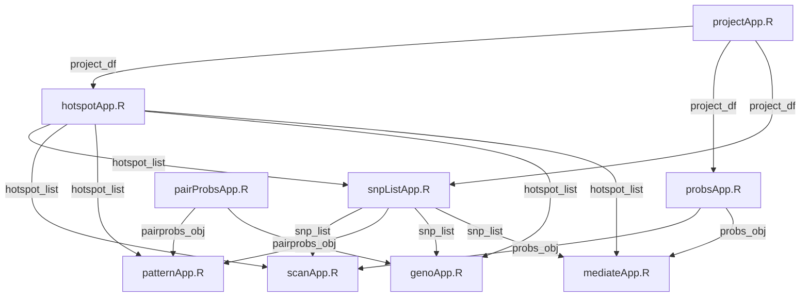
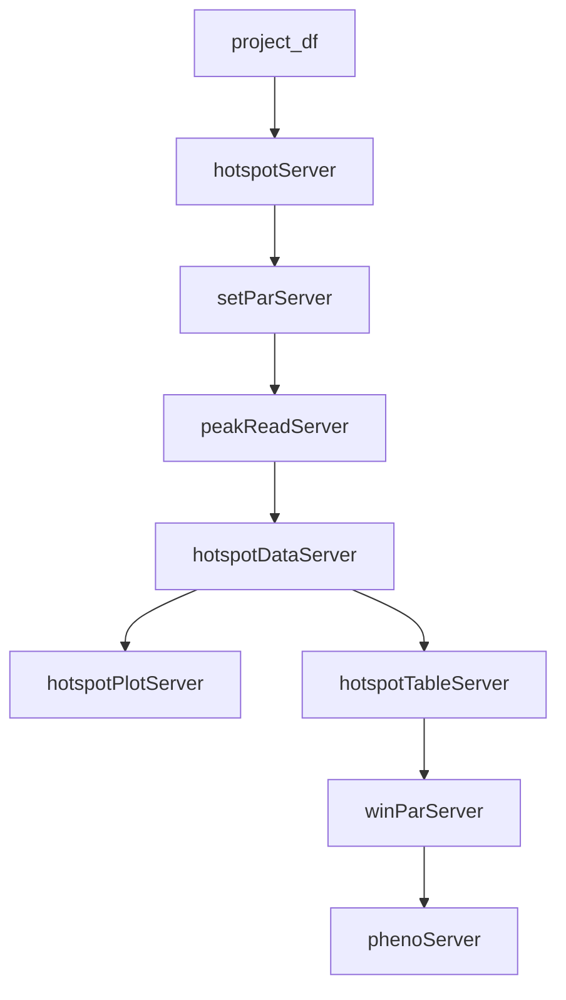
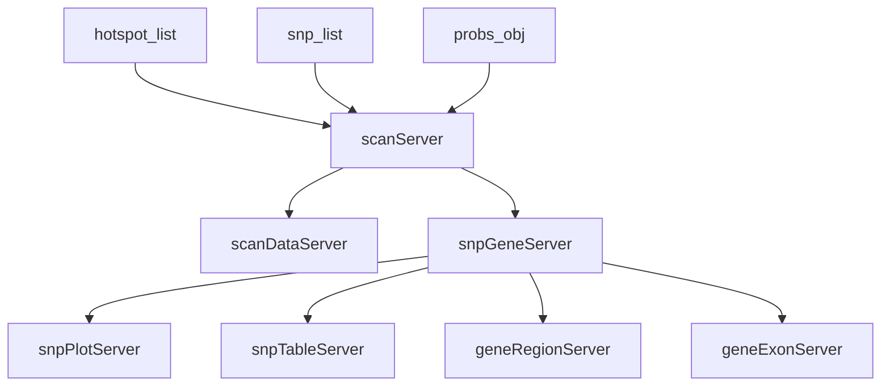
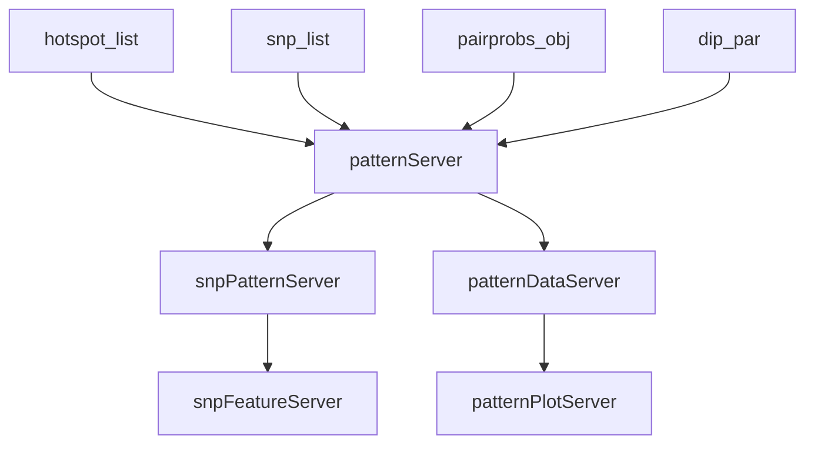
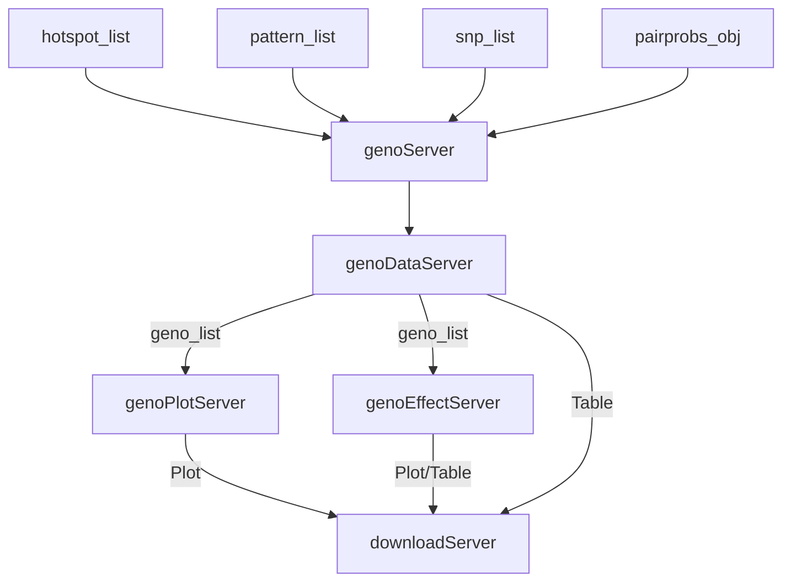
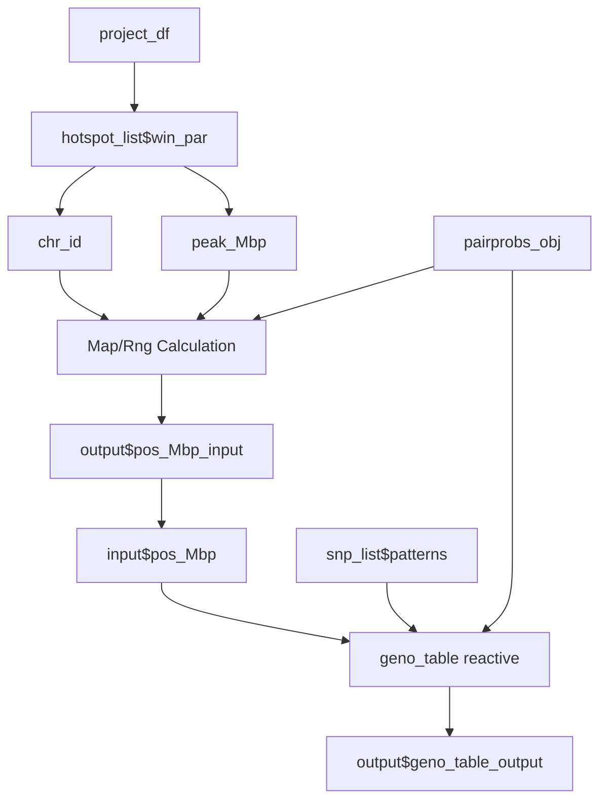
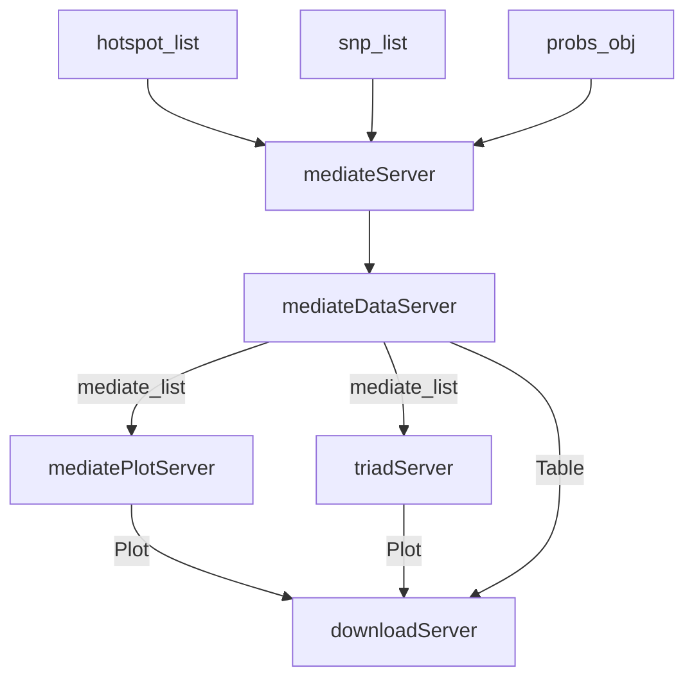

# qtl2shiny Developer Guide

This document is a comprehensive Developer Guide for the **qtl2shiny** R package. It details data structures, folder organization, high-level Shiny application architecture, module communication flow, and individual panel implementation guides.

---

## Table of Contents

- [1. Data Structures & Folder Organization](#1-data-structures--folder-organization)
  - [App Folder Structure](#app-folder-structure)
  - [Taxa Information](#taxa-information)
  - [Project Information](#project-information)
  - [Data Files Setup](#data-files-setup)
  - [Genotype Probabilities (FST Databases)](#genotype-probabilities-fst-databases)
  - [Query Routines](#query-routines)
  - [Remote Files and Connections](#remote-files-and-connections)
  - [File Types](#file-types)
- [2. High-Level Architecture & Layout](#2-high-level-architecture--layout)
  - [UI Layout (`bslib` Integration)](#ui-layout-bslib-integration)
  - [Module Communication & Data Flow](#module-communication--data-flow)
  - [Download Framework (`downr` Integration)](#download-framework-downr-integration)
- [3. Analysis Panels](#3-analysis-panels)
  - [A. Hotspots & Phenotypes (`hotspotApp`)](#a-hotspots--phenotypes-hotspotapp)
  - [B. Allele & SNP Scans (`scanApp`)](#b-allele--snp-scans-scanapp)
  - [C. Pattern Analysis (`patternApp`)](#c-pattern-analysis-patternapp)
  - [D. Genotypes (`genoApp`)](#d-genotypes-genoapp)
  - [E. Scatter Plot (`scatterApp` / `scatterPlotApp`)](#e-scatter-plot-scatterapp--scatterplotapp)
  - [F. Mediation (`mediateApp`)](#f-mediation-mediateapp)
- [4. Generic & Utility Modules](#4-generic--utility-modules)
- [5. Comprehensive Module File Mapping](#5-comprehensive-module-file-mapping)

---

## 1. Data Structures & Folder Organization

The interface assumes the main Shiny app file [`inst/qtl2shinyApp/app.R`](inst/qtl2shinyApp/app.R) is located alongside the project registry and data folder, `qtl2shinyData`.

The CSV file `projects.csv` (located in `qtl2shinyData/projects.csv`) contains project registry information:

```csv
project,taxa,directory
Recla,CCmouse,qtl2shinyData
```

Column definitions:
- **`project`**: The project identifier (e.g. `Recla`).
- **`taxa`**: The taxa identifier (e.g. `CCmouse`).
- **`directory`**: Relative or absolute path to the directory where data are kept (`qtl2shinyData`).

### App Folder Structure

```
inst/qtl2shinyApp/
├── app.R
├── about.md
├── about-extended.md
└── qtl2shinyData/
    ├── projects.csv
    └── CCmouse/
        ├── allele_info.rds
        ├── taxa_info.rds
        ├── cc-variants.sqlite
        ├── mouse_genes_mgi.sqlite
        ├── query_genes.rds
        ├── query_variants.rds
        └── Recla/
            ├── genoprob/
            │   ├── fprobs.rds
            │   └── faprobs.rds
            ├── kinship.rds
            ├── pmap.rds
            ├── covar.rds
            ├── pheno_data.rds
            ├── analyses.rds
            ├── peaks.rds
            ├── hotspot.rds
            ├── query_mrna.rds
            └── query_probs.rds
```

### Taxa Information

The `taxa` directory (`CCmouse`) contains taxa-wide references, SQLite databases, and query functions (see [rqtl/qtl2db](https://github.com/rqtl/qtl2db)):

| File | Description |
| :--- | :--- |
| `allele_info.rds` | Information on founder alleles for the taxa |
| `taxa_info.rds` | Taxa metadata (e.g., species name for Ensembl lookup) |
| `cc-variants.sqlite` | SQLite database of structural variants |
| `mouse_genes_mgi.sqlite` | SQLite database of MGI-curated gene annotations |
| `query_genes.rds` | Saved gene query function |
| `query_variants.rds` | Saved variant query function |

### Project Information

The `project` directory (`Recla`) holds project-specific datasets saved as RDS objects. Genotype probabilities are converted from `calc_genoprob` format to `fst_genoprob` format using `qtl2fst`. Sample identifiers must be consistent across `covar.rds`, `pheno_data.rds`, and genotype probabilities.

| File | Description |
| :--- | :--- |
| `genoprob/` | Directory containing FST-backed genotype probabilities |
| `kinship.rds` | LOCO (Leave-One-Chromosome-Out) kinship matrices |
| `pmap.rds` | Physical map of markers and genomic coordinates |
| `covar.rds` | Covariates data frame (rows = individuals, columns = covariates) |
| `pheno_data.rds` | Phenotype matrix (rows = individuals, columns = phenotypes) |
| `analyses.rds` | Analysis metadata data frame (one row per phenotype) |
| `peaks.rds` | Precomputed QTL peaks data frame (one row per peak) |
| `hotspot.rds` | Hotspot object containing peak counts by genomic position |
| `query_mrna.rds` | Saved mRNA query function |
| `query_probs.rds` | Saved genotype probability query function |

### Data Files Setup

Creating project files in R and saving them to the project directory:

```r
project_info <- utils::read.csv("project.csv")
project_dir <- file.path(project_info$taxa[1], project_info$project[1])

saveRDS(kinship, file.path(project_dir, "kinship.rds"))
saveRDS(pmap, file.path(project_dir, "pmap.rds"))
saveRDS(covar, file.path(project_dir, "covar.rds"))
saveRDS(pheno, file.path(project_dir, "pheno_data.rds"))
saveRDS(analyses_tbl, file.path(project_dir, "analyses.rds"))
saveRDS(peaks, file.path(project_dir, "peaks.rds"))
saveRDS(hots, file.path(project_dir, "hotspot.rds"))
```

### Genotype Probabilities (FST Databases)

Genotype probabilities are stored in `fst` disk-backed databases by chromosome for high-performance retrieval:

```r
# Create directory for fst data (must be named "genoprob")
fst_dir <- file.path(project_dir, "genoprob")
dir.create(fst_dir)

# Calculate allele-pair genotype probabilities
probs <- qtl2::calc_genoprob(recla, gmap, err = 0.002)

# Convert allele-pair probabilities to fst format
fprobs <- qtl2pattern::fst_genoprob(probs, "probs", fst_dir)
saveRDS(fprobs, file = file.path(fst_dir, "fprobs.rds"))

# Convert allele-pair probabilities to allele probabilities
aprobs <- genoprob_to_alleleprob(probs)
faprobs <- fst_genoprob(aprobs, "aprobs", fst_dir)
saveRDS(faprobs, file = file.path(fst_dir, "faprobs.rds"))
```

### Query Routines

Query routines encapsulate data access paths by closing over local database locations and storing the functions as RDS objects:

```r
# Gene Query
query_genes <- qtl2::create_gene_query_func("CCmouse/mouse_genes.sqlite")
saveRDS(query_genes, "query_genes.rds")

# Variant Query
query_variants <- qtl2::create_variant_query_func("CCmouse/cc-variants.sqlite")
saveRDS(query_variants, "query_variants.rds")

# Query usage
genes <- query_genes(chr = "1", start = 39, end = 40)
variants <- query_variants(chr = "1", start = 39, end = 40)
```

Project-specific queries for genotype probabilities and mRNA expression:

```r
query_probs <- qtl2pattern::create_probs_query_func_do("CCmouse/Recla")
saveRDS(query_probs, "query_probs.rds")

query_mrna <- qtl2pattern::create_mrna_query_func_do(NULL)
saveRDS(query_mrna, "query_mrna.rds")

# Invoking project queries
probs <- query_probs(chr = "1", start = 39, end = 40, allele = TRUE, method = "fst")
mrna  <- query_mrna(chr = "1", start = 39, end = 40, local = TRUE, qtl = FALSE)
```

### Remote Files and Connections

Data directories for a `taxa` and `project` can be located on a remote or network file system, specified via an absolute path in `projects.csv`. For performance, data should reside on a locally mounted filesystem.

### File Types

- **RDS (`.rds`)**: Used for map objects, kinship matrices, phenotypes, covariates, peak tables, and query closures to preserve R data types and environment bindings.
- **FST (`.fst`) / SQLite (`.sqlite`)**: Used for high-density genotype probabilities and variant/gene annotation databases to support fast indexed queries.

---

## 2. High-Level Architecture & Layout

The main entry point is defined in [`R/qtl2shinyApp.R`](R/qtl2shinyApp.R). It uses the **Bootstrap 5 (`bslib`)** framework to build a responsive, sidebar-driven analytical dashboard.

### UI Layout (`bslib` Integration)

The dashboard layout is instantiated in `qtl2shinyUI()`:

- **Global Sidebar**: Contains shared control selectors:
  - Project registry selector ([`R/projectApp.R`](R/projectApp.R))
  - Phenotype dataset class & model parameters ([`R/hotspotInput`](R/hotspotApp.R))
  - Genetic model / diplotype parameters ([`R/dipParApp.R`](R/dipParApp.R))
  - SNP and phenotype subset filters ([`R/snpListApp.R`](R/snpListApp.R))
- **Header**: Integrates the download dropdown widget (`downr::downloadInput`) dynamically connected to the active panel.
- **Main Body**: Organizes analysis panels into six navigation tabs (`bslib::nav_panel`):
  1. **Hotspots & Phenotypes**
  2. **Allele & SNP Scans**
  3. **Patterns**
  4. **Genotypes**
  5. **Scatter Plot**
  6. **Mediation**

### Module Communication & Data Flow

Modules communicate reactively via parameters passed from parent modules or shared through returned reactive lists:



### Download Framework (`downr` Integration)

Each active panel exposes a reactive list containing:
- **`Plot`**: Reactive expression returning the current ggplot or plotly object.
- **`Table`**: Reactive expression returning the current data frame or DT table.
- **`Filename`**: Output file prefix constructed from active settings and phenotype names.
- **`Type`**: Selector defining export type (plot, table, or user choice).

`qtl2shinyServer()` monitors the active tab (`input$panel`) and routes the corresponding download list to `downr::downloadServer("download", download_list_panel)`.

---

## 3. Analysis Panels

### A. Hotspots & Phenotypes (`hotspotApp`)

The **Hotspots & Phenotypes** panel is the entry point for dataset loading, genome-wide QTL peak density (hotspot) visualization, and phenotype distribution exploration.

#### Module Hierarchy & Entrypoints

- **Top-Level Container**:
  - App Launcher: `hotspotApp()`
  - Server Module: `hotspotServer(id, project_df, main_par)`
  - UI Functions: `hotspotInput(id)`, `hotspotOutput(id)`
- **Hotspot Sub-Modules**:
  - `hotspotDataApp`: Computes peak count densities (`hotspotDataServer`)
  - `hotspotTableApp`: Searchable peaks/hotspots data table (`hotspotTableServer`)
  - `hotspotPlotApp`: Density plots of QTL peaks (`hotspotPlotServer`)
  - `peakApp` / `peakReadApp`: Reads and filters precomputed `peaks.rds` (`peakServer`, `peakReadServer`)
- **Phenotype Sub-Modules**:
  - `phenoApp`: Sub-panel container (`phenoServer`)
  - `phenoReadApp`: Reads raw phenotype data matrix (`phenoReadServer`)
  - `phenoNamesApp`: Phenotype selection inputs (`phenoNamesServer`)
  - `phenoDataApp`: Rank-Z normalization and transformation (`phenoDataServer`)
  - `phenoTableApp`: Renders phenotype data tables (`phenoTableServer`)
  - `phenoPlotApp`: Renders boxplots, histograms, and scatterplots (`phenoPlotServer`)

#### Server Logic & Reactive Flow



---

### B. Allele & SNP Scans (`scanApp`)

The **Allele & SNP Scans** panel compares genome-wide scans using multi-parent founder allele coefficients against high-density SNP association mapping.

#### Module Hierarchy & Entrypoints

- **Top-Level Container**:
  - App Launcher: `scanApp()`
  - Server Module: `scanServer(id, hotspot_list, snp_list, probs_obj, project_df)`
  - UI Functions: `scanInput(id)`, `scanOutput(id)`
- **Allele Scan Sub-Modules**:
  - `scanDataApp`: Computes allele LOD and BLUP scans (`scanDataServer`)
- **SNP & Gene Sub-Modules**:
  - `snpGeneApp`: Sub-panel coordinator (`snpGeneServer`)
  - `snpPlotApp`: Renders Manhattan SNP association plots (`snpPlotServer`)
  - `snpTableApp`: Searchable variants table (`snpTableServer`)
  - `geneRegionApp`: Queries and displays gene tracks (`geneRegionServer`)
  - `geneExonApp`: Queries detailed exon structures (`geneExonServer`)

#### Server Logic & Reactive Flow



---

### C. Pattern Analysis (`patternApp`)

The **Patterns** panel analyzes Strain Distribution Patterns (SDPs) in candidate QTL regions to group SNPs by founder allele distributions and evaluate causal variant patterns.

#### Module Hierarchy & Entrypoints

- **Top-Level Container**:
  - App Launcher: `patternApp()`
  - Server Module: `patternServer(id, dip_par, hotspot_list, snp_list, pairprobs_obj, project_df)`
  - UI Functions: `patternInput(id)`, `patternOutput(id)`
- **Sub-Modules**:
  - `snpPatternApp`: Coordinates pattern list filtering (`snpPatternServer`)
  - `snpFeatureApp`: Annotates variant consequences (synonymous, coding, intron, splice site) (`snpFeatureServer`)
  - `patternDataApp`: Computes SDP scan regressions (`patternDataServer`)
  - `patternPlotApp`: Renders multi-phenotype SDP scan comparisons (`patternPlotServer`)

#### Server Logic & Reactive Flow



---

### D. Genotypes (`genoApp`)

The **Genotypes** panel inspects multi-point founder genotype probabilities, diplotype patterns, and phenotypic effects at specific physical markers.

#### Module Hierarchy & Entrypoints

- **Top-Level Container**:
  - App Launcher: `genoApp()`
  - Server Module: `genoServer(id, hotspot_list, pattern_list, snp_list, pairprobs_obj, project_df)`
  - UI Functions: `genoInput(id)`, `genoOutput(id)`
- **Sub-Modules**:
  - `genoDataApp`: Loads pairwise diplotype probabilities and updates marker sliders (`genoDataServer`)
  - `genoPlotApp`: Plots individual genotype probabilities across chromosomes (`genoPlotServer`)
  - `genoEffectApp`: Computes and plots phenotype averages/BLUPs by genotype class (`genoEffectServer`)

#### Top-Level Server Logic (`genoServer`)



#### Genotype Data Flow (`genoDataApp`)



#### Marker Slider Observer Logic (`genoDataApp`)

```r
observeEvent(shiny::req(win_par()), {
  if (shiny::isTruthy(input$pos_Mbp)) {
    map <- shiny::req(pairprobs_obj()$map)
    chr <- shiny::req(chr_id())
    rng <- round(2 * range(map[[chr]])) / 2
    value <- shiny::req(peak_Mbp())
    if (value < rng[1] || value > rng[2]) value <- mean(rng)
    shiny::updateSliderInput(session, "pos_Mbp", NULL, value, rng[1], rng[2], step = 0.1)
  }
})
```

#### Effect Scanning & Plotting (`genoEffectApp`)

```r
# Effect scanning reactive
effect_obj <- shiny::reactive({
  shiny::req(snp_action(), project_df(), pairprobs_obj(),
             hotspot_list$kinship_list(), hotspot_list$covar_df(),
             hotspot_list$peak_df(), pattern_list$scan_pattern())
  pheno_name <- shiny::req(pattern_list$pat_par$pheno_name)
  pheno_mx <- shiny::req(hotspot_list$pheno_mx())[, pheno_name, drop = FALSE]
  blups <- attr(pattern_list$scan_pattern(), "blups")
  
  appProgress('Effect scans', pheno_name, {
    shiny::setProgress(1)
    effect_scan(pheno_mx, hotspot_list$covar_df(),
                pairprobs_obj(), hotspot_list$kinship_list(),
                hotspot_list$peak_df(), patterns(),
                pattern_list$scan_pattern(), blups)
  })
})

# Autoplot at marker position
p <- ggplot2::autoplot(eff, pos = pos_Mbp())
p + ggplot2::ggtitle(colnames(hotspot_list$pheno_mx()))
```

---

### E. Scatter Plot (`scatterApp` / `scatterPlotApp`)

The **Scatter Plot** panel visualizes correlations between numeric phenotypes, with options to color, shape, and facet points by Strain Distribution Patterns (SDPs), genotype calls, sex, or diet covariates.

#### Module Hierarchy & Entrypoints

- **Top-Level Container**:
  - App Launcher: `scatterApp()`
  - Server Module: `scatterServer(id, hotspot_list, pattern_list, snp_list, pairprobs_obj, project_df)`
  - UI Functions: `scatterInput(id)`, `scatterOutput(id)`
- **Reusable Plotting Module**:
  - `scatterPlotApp`: Standard plotting engine (`scatterPlotServer(id, plot_df, x_label, y_label)`)

#### Plot Customization & Aesthetic Rules (`scatterPlotApp`)

1. **Hollow / Open Shapes**: Points default to open shape `1` (hollow circle) to prevent overplotting. Discrete shape mappings utilize open shape codes (`1`, `2`, `5`, `0`, `6`).
2. **Bold Symbol Stroke**: `stroke = 1.5` is set on point geometries to ensure outlines remain legible when transparency (`alpha`) is applied.
3. **Regression Lines**: Solid regression lines are drawn underneath point symbols. When `color_by` is selected, separate grouped regression lines are computed automatically.
4. **Robust Faceting**: To accommodate colons (`:`) in pattern names (e.g. `"A:B"`), faceting uses tidy evaluation:
   `facet_wrap(ggplot2::vars(.data[[facet_var]]))`

---

### F. Mediation (`mediateApp`)

The **Mediation** panel performs causal inference to identify intermediate variables (such as mRNA expression or protein abundance) that mediate the path between a genomic QTL driver locus and a downstream phenotype.

#### Module Hierarchy & Entrypoints

- **Top-Level Container**:
  - App Launcher: `mediateApp()`
  - Server Module: `mediateServer(id, hotspot_list, snp_list, probs_obj, project_df)`
  - UI Functions: `mediateInput(id)`, `mediateOutput(id)`
- **Sub-Modules**:
  - `mediateDataApp`: Computes regression models via `qtl2mediate::mediate1()` (`mediateDataServer`)
  - `mediatePlotApp`: Visualizes LOD drop profiles along chromosomes (`mediatePlotServer`)
  - `triadApp`: Renders Driver-Mediator-Trait triad scatterplot grids (`triadServer`)

#### Server Logic & Reactive Flow



---

## 4. Generic & Utility Modules

Global sidebar selectors and shared data management utilities:

- **[`R/projectApp.R`](R/projectApp.R)**: Loads `projects.csv` registry and switches between taxa, databases, and study setups.
- **[`R/setParApp.R`](R/setParApp.R)**: Dynamically extracts study-specific parameters (phenotype class, subject model) from the selected project.
- **[`R/winParApp.R`](R/winParApp.R)**: Tracks the active chromosomal window (Chromosome, Start Mbp, End Mbp).
- **[`R/dipParApp.R`](R/dipParApp.R)**: Manages genetic model options (additive vs. dominance actions, founder codes).
- **[`R/snpListApp.R`](R/snpListApp.R)**: Consolidated input selector for SNP filtering, coordinates, min LOD sliders, and phenotype subsets.
- **[`R/probsApp.R`](R/probsApp.R)**: Reactive loader for multi-point founder genotype probabilities using fast FST database queries.
- **[`R/kinshipApp.R`](R/kinshipApp.R)**: Reactively loads LOCO kinship matrix objects for the active chromosome.
- **[`R/downloadApp.R`](R/downloadApp.R)**: Interfacing server with `downr` to manage data frame CSV exports and plot rendering (PNG/PDF).
- **[`R/scatterPlotApp.R`](R/scatterPlotApp.R)**: Generic, reusable scatter plotting module with aesthetic mappings and plotly/ggplotly toggling.

---

## 5. Comprehensive Module File Mapping

The complete mapping of all 41 `R/*App.R` files in the package:

| File Name | Primary Tab / Component | Module Type | Key Server Function |
| :--- | :--- | :--- | :--- |
| **Main Application** | | | |
| [`R/qtl2shinyApp.R`](R/qtl2shinyApp.R) | Main Dashboard | App Launcher & Entrypoint | `qtl2shinyServer` |
| **Hotspots & Phenotypes** | | | |
| [`R/hotspotApp.R`](R/hotspotApp.R) | Hotspots & Phenotypes | Panel Entrypoint | `hotspotServer` |
| [`R/hotspotDataApp.R`](R/hotspotDataApp.R) | Hotspots & Phenotypes | Density Computation | `hotspotDataServer` |
| [`R/hotspotPlotApp.R`](R/hotspotPlotApp.R) | Hotspots & Phenotypes | Plot Renderer | `hotspotPlotServer` |
| [`R/hotspotTableApp.R`](R/hotspotTableApp.R) | Hotspots & Phenotypes | Table Renderer | `hotspotTableServer` |
| [`R/peakApp.R`](R/peakApp.R) | Hotspots & Phenotypes | Peaks Summary | `peakServer` |
| [`R/peakReadApp.R`](R/peakReadApp.R) | Hotspots & Phenotypes | Data Loader | `peakReadServer` |
| [`R/phenoApp.R`](R/phenoApp.R) | Hotspots & Phenotypes | Sub-panel Container | `phenoServer` |
| [`R/phenoReadApp.R`](R/phenoReadApp.R) | Hotspots & Phenotypes | Data Loader | `phenoReadServer` |
| [`R/phenoNamesApp.R`](R/phenoNamesApp.R) | Hotspots & Phenotypes | Input Selector | `phenoNamesServer` |
| [`R/phenoDataApp.R`](R/phenoDataApp.R) | Hotspots & Phenotypes | Data Transformation | `phenoDataServer` |
| [`R/phenoTableApp.R`](R/phenoTableApp.R) | Hotspots & Phenotypes | Table Renderer | `phenoTableServer` |
| [`R/phenoPlotApp.R`](R/phenoPlotApp.R) | Hotspots & Phenotypes | Plot Renderer | `phenoPlotServer` |
| **Allele & SNP Scans** | | | |
| [`R/scanApp.R`](R/scanApp.R) | Allele & SNP Scans | Panel Entrypoint | `scanServer` |
| [`R/scanDataApp.R`](R/scanDataApp.R) | Allele & SNP Scans | Scan Computation | `scanDataServer` |
| [`R/snpGeneApp.R`](R/snpGeneApp.R) | Allele & SNP Scans | Sub-panel Coordinator | `snpGeneServer` |
| [`R/snpTableApp.R`](R/snpTableApp.R) | Allele & SNP Scans | Table Renderer | `snpTableServer` |
| [`R/snpPlotApp.R`](R/snpPlotApp.R) | Allele & SNP Scans | Plot Renderer | `snpPlotServer` |
| [`R/geneRegionApp.R`](R/geneRegionApp.R) | Allele & SNP Scans | DB Query & Plot | `geneRegionServer` |
| [`R/geneExonApp.R`](R/geneExonApp.R) | Allele & SNP Scans | DB Query & Plot | `geneExonServer` |
| **Patterns** | | | |
| [`R/patternApp.R`](R/patternApp.R) | Patterns | Panel Entrypoint | `patternServer` |
| [`R/snpPatternApp.R`](R/snpPatternApp.R) | Patterns | Sub-panel Coordinator | `snpPatternServer` |
| [`R/patternDataApp.R`](R/patternDataApp.R) | Patterns | Scan Computation | `patternDataServer` |
| [`R/patternPlotApp.R`](R/patternPlotApp.R) | Patterns | Plot Renderer | `patternPlotServer` |
| [`R/snpFeatureApp.R`](R/snpFeatureApp.R) | Patterns | Annotation Overlay | `snpFeatureServer` |
| **Genotypes** | | | |
| [`R/genoApp.R`](R/genoApp.R) | Genotypes | Panel Entrypoint | `genoServer` |
| [`R/genoDataApp.R`](R/genoDataApp.R) | Genotypes | Probability Filtering | `genoDataServer` |
| [`R/genoPlotApp.R`](R/genoPlotApp.R) | Genotypes | Plot Renderer | `genoPlotServer` |
| [`R/genoEffectApp.R`](R/genoEffectApp.R) | Genotypes | Effect Scan & Plot | `genoEffectServer` |
| **Scatter Plot** | | | |
| [`R/scatterApp.R`](R/scatterApp.R) | Scatter Plot | Panel Entrypoint | `scatterServer` |
| [`R/scatterPlotApp.R`](R/scatterPlotApp.R) | Scatter Plot | Reusable Plot Engine | `scatterPlotServer` |
| **Mediation** | | | |
| [`R/mediateApp.R`](R/mediateApp.R) | Mediation | Panel Entrypoint | `mediateServer` |
| [`R/mediateDataApp.R`](R/mediateDataApp.R) | Mediation | Regression Engine | `mediateDataServer` |
| [`R/mediatePlotApp.R`](R/mediatePlotApp.R) | Mediation | Plot Renderer | `mediatePlotServer` |
| [`R/triadApp.R`](R/triadApp.R) | Mediation | Triad Grid Renderer | `triadServer` |
| **Generic & Utilities** | | | |
| [`R/projectApp.R`](R/projectApp.R) | Global Sidebar | Generic Utility | `projectServer` |
| [`R/setParApp.R`](R/setParApp.R) | Global Sidebar | Generic Utility | `setParServer` |
| [`R/winParApp.R`](R/winParApp.R) | Global Sidebar | Generic Utility | `winParServer` |
| [`R/dipParApp.R`](R/dipParApp.R) | Global Sidebar | Generic Utility | `dipParServer` |
| [`R/snpListApp.R`](R/snpListApp.R) | Global Sidebar | Generic Utility | `snpListServer` |
| [`R/probsApp.R`](R/probsApp.R) | Data Loader | Generic Utility | `probsServer` |
| [`R/kinshipApp.R`](R/kinshipApp.R) | Data Loader | Generic Utility | `kinshipServer` |
| [`R/downloadApp.R`](R/downloadApp.R) | Global Header | Generic Utility | `downloadServer` |
