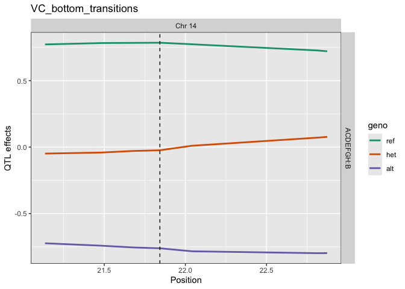
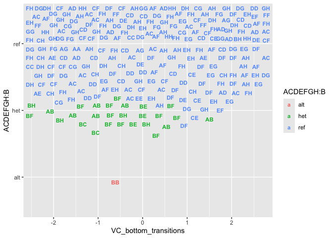
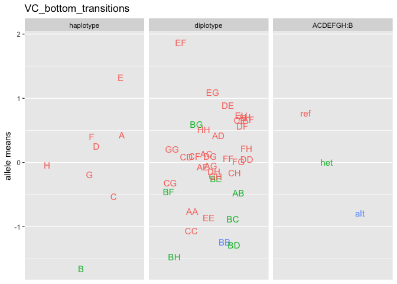

# Workflow with Recla Data

This illustrates the functions used in shiny modules to show the
workflow. Functions are either exported (`qtl2shiny::xxx()`) or internal
(`qtl2shiny:::xxx()`) for arcane reasons.

## Read Data

The data sit in a folder, say `qtl2shinyData`, with a file
`projects.csv` that looks like

<table>
<thead>
<tr>
<th style="text-align: left;">project</th>
<th style="text-align: left;">taxa</th>
<th style="text-align: left;">directory</th>
</tr>
</thead>
<tbody>
<tr>
<td style="text-align: left;">Recla</td>
<td style="text-align: left;">CCmouse</td>
<td style="text-align: left;">qtl2shinyData</td>
</tr>
</tbody>
</table>

The canonical data is `Recla`, which can be found at
[github.com/rqtl/qtl2data/DO\_Recla2](https://github.com/rqtl/qtl2data/tree/main/DO_Recla2).

Set up `project_df` dataframe. See
[projectServer()](https://github.com/byandell-sysgen/qtl2shiny/blob/master/R/projectApp.R).

    datadir <- "qtl2shinyData"
    project_df <- read.csv(file.path(datadir, "projects.csv")) |>
      dplyr::filter(project == "Recla")
    project_df

    ##   project    taxa     directory
    ## 1   Recla CCmouse qtl2shinyData

The following are set up in
[setParServer()](https://github.com/byandell-sysgen/qtl2shiny/blob/master/R/setParApp.R).

    (project_class <- qtl2shiny::project_classes(project_df))

    ## [1] "group"

    (subject_model <- qtl2shiny::project_subject_model(project_df, project_class))

    ## [1] "all_mice_additive"

    (window_Mbp <- 1)

    ## [1] 1

    (minLOD <- 3)

    ## [1] 3

Read peaks in
[peakReadServer()](https://github.com/byandell-sysgen/qtl2shiny/blob/master/R/peakReadApp.R).

    (peak_read_df <- qtl2shiny::read_peaks(project_df, project_class[1],
                            subject_model = subject_model[1])) |>
      dplyr::filter(qtl_lod >= 5.5) |>
      dplyr::count(phenotype_class, phenotype, addcovar)

    ## # A tibble: 24 × 4
    ##    phenotype_class phenotype             addcovar                              n
    ##    <chr>           <chr>                 <chr>                             <int>
    ##  1 group           HP_latency            ~sex+Cohort+Group+Subgroup+ngen+…     3
    ##  2 group           LD_distance_light     ~sex+Cohort+Group+Subgroup+ngen+…     3
    ##  3 group           LD_light_pct          ~sex+Cohort+Group+Subgroup+ngen+…     3
    ##  4 group           LD_transitions        ~sex+Cohort+Group+Subgroup+ngen+…     2
    ##  5 group           OF_corner_pct         ~sex+Cohort+Group+Subgroup+ngen+…     3
    ##  6 group           OF_distance           ~sex+Cohort+Group+Subgroup+ngen+…     3
    ##  7 group           OF_distance_first4    ~sex+Cohort+Group+Subgroup+ngen+…     2
    ##  8 group           OF_immobile_pct       ~sex+Cohort+Group+Subgroup+ngen+…     5
    ##  9 group           OF_periphery_pct      ~sex+Cohort+Group+Subgroup+ngen+…     1
    ## 10 group           TS_frequency_climbing ~sex+Cohort+Group+Subgroup+ngen+…     4
    ## # ℹ 14 more rows

## Hotspots and Phenotypes Panel

The hotspot panel
[hotspotServer()](https://github.com/byandell-sysgen/qtl2shiny/blob/master/R/hotspotApp.R)
includes several steps for hotspots and phenotypes.

### Hotspots

Create hotspots in
[hotspotDataServer()](https://github.com/byandell-sysgen/qtl2shiny/blob/master/R/hotspotDataApp.R).

    pmap_obj <- qtl2shiny::read_project(project_df, "pmap")
    sapply(pmap_obj, length)

    ##   1   2   3   4   5   6   7   8   9  10  11  12  13  14  15  16  17  18  19   X 
    ## 537 544 469 452 438 447 428 376 388 430 394 356 363 369 303 300 270 261 196 442

    hotspot_obj <- qtl2shiny:::hotspot(pmap_obj, peak_read_df, window_Mbp, minLOD,
                                       chrs = NULL)
    names(hotspot_obj)

    ## [1] "scan" "map"

Display `hotspot_df` in
[hotspotTableServer()](https://github.com/byandell-sysgen/qtl2shiny/blob/master/R/hotspotTableApp.R).

    (hotspot_df <- summary(hotspot_obj))

    ## # A tibble: 20 × 4
    ##    hotspot    chr     pos group
    ##    <chr>      <fct> <dbl> <dbl>
    ##  1 14:22 (11) 14       22    11
    ##  2 11:97 (8)  11       97     8
    ##  3 19:5 (8)   19        5     8
    ##  4 5:38 (7)   5        38     7
    ##  5 12:99 (7)  12       99     7
    ##  6 13:110 (7) 13      110     7
    ##  7 16:33 (6)  16       33     6
    ##  8 18:32 (6)  18       32     6
    ##  9 1:124 (5)  1       124     5
    ## 10 6:110 (5)  6       110     5
    ## 11 9:70 (5)   9        70     5
    ## 12 10:116 (5) 10      116     5
    ## 13 15:32 (5)  15       32     5
    ## 14 2:115 (4)  2       115     4
    ## 15 7:139 (4)  7       139     4
    ## 16 3:26 (3)   3        26     3
    ## 17 4:140 (3)  4       140     3
    ## 18 8:77 (3)   8        77     3
    ## 19 17:66 (3)  17       66     3
    ## 20 X:6 (1)    X         6     1

Plot `hotspot_obj` in
[hotspotPlotServer()](https://github.com/byandell-sysgen/qtl2shiny/blob/master/R/hotspotPlotApp.R).

    qtl2shiny:::plot_hot(hotspot_obj, project_class, window_Mbp)

The window parameter are in
[winParServer()](https://github.com/byandell-sysgen/qtl2shiny/blob/master/R/winParApp.R).

    (hotspot <- hotspot_df$hotspot[1])

    ## [1] "14:22 (11)"

    (chr_id <- as.character(hotspot_df$chr[1]))

    ## [1] "14"

    (peak_Mbp <- hotspot_df$pos[1])

    ## [1] 22

    (hotspot_count <- hotspot_df$group[1])

    ## [1] 11

Peak dataframe is now refined with
[peakServer()](https://github.com/byandell-sysgen/qtl2shiny/blob/master/R/peakApp.R).

    (peak_df <- qtl2shiny:::peaks_in_pos(peak_read_df, TRUE,
      chr_id = chr_id, pos_Mbp = peak_Mbp, win = window_Mbp)) |>
      dplyr::select(phenotype_class, phenotype_original, qtl_lod, qtl_pos, addcovar)

    ## # A tibble: 11 × 5
    ##    phenotype_class phenotype_original        qtl_lod qtl_pos addcovar           
    ##    <chr>           <chr>                       <dbl>   <dbl> <chr>              
    ##  1 group           VC_bottom_transitions         7.1    22.8 ~sex+Cohort+Group+…
    ##  2 group           VC_bottom_distance            6.4    22.8 ~sex+Cohort+Group+…
    ##  3 group           VC_top_velocity               5.8    22.9 ~sex+Cohort+Group+…
    ##  4 group           LD_light_pct                  5.3    22.9 ~sex+Cohort+Group+…
    ##  5 group           VC_top_time_pct               5.1    22.8 ~sex+Cohort+Group+…
    ##  6 group           VC_bottom_time_pct            5.1    22.8 ~sex+Cohort+Group+…
    ##  7 group           LD_distance_light             5      22.9 ~sex+Cohort+Group+…
    ##  8 group           VC_top_time_first4            4.2    22.9 ~sex+Cohort+Group+…
    ##  9 group           VC_bottom_time_first4         3.9    22.9 ~sex+Cohort+Group+…
    ## 10 group           VC_bottom_distance_first4     3.9    22.9 ~sex+Cohort+Group+…
    ## 11 group           HP_latency                    3.2    21.8 ~sex+Cohort+Group+…

### Phenotypes

Phenotypes are determined with
[phenoServer()](https://github.com/byandell-sysgen/qtl2shiny/blob/master/R/phenoApp.R),
which in itself has several steps

    covar_df <- qtl2shiny::read_project(project_df, "covar")

Phenotype names are pulled from `peak_df` with
[phenoNamesServer()](https://github.com/byandell-sysgen/qtl2shiny/blob/master/R/phenoNamesApp.R),

    (pheno_names <- peak_df$phenotype)

    ##  [1] "VC_bottom_transitions"     "VC_bottom_distance"       
    ##  [3] "VC_top_velocity"           "LD_light_pct"             
    ##  [5] "VC_top_time_pct"           "VC_bottom_time_pct"       
    ##  [7] "LD_distance_light"         "VC_top_time_first4"       
    ##  [9] "VC_bottom_time_first4"     "VC_bottom_distance_first4"
    ## [11] "HP_latency"

    pheno_name <- pheno_names[1]

Read phenotype data with
[phenoReadServer()](https://github.com/byandell-sysgen/qtl2shiny/blob/master/R/phenoReadApp.R),

    pheno_read_mx <- qtl2shiny::read_pheno(project_df, project_class, columns = pheno_names,
                     peak_df = peak_df)

Rankz-transform phenotype data for `pheno_name` with
[phenoDataServer()](https://github.com/byandell-sysgen/qtl2shiny/blob/master/R/phenoDataApp.R),

    pheno_mx <- qtl2shiny:::pheno_rankz(pheno_read_mx[, pheno_name, drop = FALSE])

Display summary table with
[phenoTableServer()](https://github.com/byandell-sysgen/qtl2shiny/blob/master/R/phenoTableApp.R).

    qtl2shiny:::summary_na(pheno_mx, covar_df)

    ## # A tibble: 2 × 5
    ##   phenotype             sex      mean    sd    na
    ##   <chr>                 <chr>   <dbl> <dbl> <int>
    ## 1 VC_bottom_transitions female  0.128 0.984     2
    ## 2 VC_bottom_transitions male   -0.136 0.965     1

Plot phenotypes with
[phenoPlotServer()](https://github.com/byandell-sysgen/qtl2shiny/blob/master/R/phenoPlotApp.R).

    qtl2shiny:::plot_sex(pheno_mx, covar_df)

 \##
Allele and SNP Scan Panel

Allele and SNP scans are performed with the scan panel
[scanServer()](https://github.com/byandell-sysgen/qtl2shiny/blob/master/R/scanApp.R).

### Allele Scan

The first step is to set up the `probs_obj` with
[probsServer()](https://github.com/byandell-sysgen/qtl2shiny/blob/master/R/probsApp.R).

    dir()

    ##  [1] "about-extended.md"  "about.md"           "app_legacy.R"      
    ##  [4] "app.R"              "DO1200Data.html"    "DO1200Data.md"     
    ##  [7] "DO1200Data.Rmd"     "DO1200Study.Rmd"    "doc"               
    ## [10] "LICENSE"            "qtl2shinyApp.Rproj" "qtl2shinyData"     
    ## [13] "ReadMe_RD.html"     "ReadMe_RD.md"       "README.md"         
    ## [16] "Recla.html"         "Recla.Rmd"          "scan_lipid_obj.rds"
    ## [19] "transition.Rmd"     "workflow.md"

\*\* problem in qtl2pattern:::read\_probs `chr` may factor and needs

    query_probs <- qtl2shiny:::read_query_rds(project_df, "query_probs.rds")
    start_val <- peak_Mbp - window_Mbp
    end_val <- peak_Mbp + window_Mbp
    probs_obj <- query_probs(chr_id, start_val, end_val)

Also need \`kinship\_list from
[kinshipServer()](https://github.com/byandell-sysgen/qtl2shiny/blob/master/R/kinshipApp.R).

    kinship_list <- qtl2shiny::read_project(project_df, "kinship")[chr_id]

The traditional allele (genome) scan is done with
[scanDataServer()](https://github.com/byandell-sysgen/qtl2shiny/blob/master/R/scanDataApp.R).

    scan_obj <- qtl2shiny::scan1covar(pheno_mx, covar_df, probs_obj$probs,
                                       kinship_list, peak_df)

    scan_window <- range(probs_obj$map[[chr_id]])
    print(qtl2shiny:::plot_scan(scan_obj, probs_obj$map, seq(ncol(scan_obj)),
                                chr_id, scan_window, pheno_mx))

    summary(scan_obj, probs_obj$map)

    ## # A tibble: 1 × 5
    ##   pheno                 chr     pos marker      lod
    ##   <chr>                 <fct> <dbl> <chr>     <dbl>
    ## 1 VC_bottom_transitions 14     22.8 c14.loc13  7.92

    eff_obj <- qtl2shiny:::scan1_effect(probs_obj$probs, pheno_mx, kinship_list,
                                        covar_df, peak_df, blups = FALSE)

    allele_info <- qtl2shiny::read_project(project_df, "allele_info")

    qtl2shiny:::plot_eff(pheno_name, eff_obj, probs_obj$map, scan_obj, scan_window,,
                         allele_info)

### SNP Scans

SNP scans (SNP association maps) are done with
[snpGeneServer()](https://github.com/byandell-sysgen/qtl2shiny/blob/master/R/snpGeneApp.R).

#### SNP Internal List

This requires a list of objects `snp_list` created with
[snpListServer()](https://github.com/byandell-sysgen/qtl2shiny/blob/master/R/snpListApp.R).

The `snp_par` parameters are those already set above. In the shiny app,
some can be modified in later sub-panels.

There are two ways to set up SNP probabilities, using the allele pairs
or directly using recomputed SNP probabilities. \*\* The
`qtl2shiny::snpProbsServer()` uses `qtl2pattern:::read_probs()` with
`allelle = FALSE` (allele pairs) instead of `allele = "SNP"`. It should
check to see if the `snpprobs_fstindex.rds` exists. Need to also check
that this object has the `snpinfo` or if we need to get it from SNP
variants and add columns.\*\*

Currently, Recla is not set up to use precomputed SNP probabilities.

    # `query_probs` defined above for traditional allele scans.
    pair_probs_obj <- query_probs(chr_id, start_val, end_val, allele = FALSE)
    # define the query_variants function
    query_variants <- qtl2shiny:::read_query_rds(project_df, "query_variants.rds")
    snpinfo <- query_variants(chr_id, start_val, end_val)
    snpprobs_obj <- qtl2mediate::get_snpprobs(chr_id, peak_Mbp, window_Mbp,
      pheno_names, pair_probs_obj$probs, pair_probs_obj$map, snpinfo)
    snpinfo <- snpprobs_obj$snpinfo

The `snpinfo` object is needed for other panels. The `snpprobs_obj` is
only used below inside this panel to create other objects passed along
via `snp_list`.

    snp_scan_obj <- qtl2shiny::scan1covar(pheno_mx, covar_df,
      snpprobs_obj$snpprobs, kinship_list, peak_df)

    drop_hilit <- max(unclass(snp_scan_obj)) - minLOD
    top_snps_tbl <- qtl2pattern::top_snps_pattern(snp_scan_obj, snpinfo, drop_hilit)

    gene_exon_tbl <- qtl2shiny:::gene_exons(top_snps_tbl, project_df)

    (patterns <- qtl2shiny:::top_patterns(top_snps_tbl))

    ## # A tibble: 1 × 9
    ##   pheno            min_pos max_pos max_lod min_lod   sdp pattern snp_id contrast
    ##   <chr>              <dbl>   <dbl>   <dbl>   <dbl> <dbl> <chr>   <chr>  <chr>   
    ## 1 VC_bottom_trans…    21.5    21.6    3.71    3.36     2 ACDEFG… 7 SNPs basic

### SNP Summaries

SNP summaries
[snpPlotServer()](https://github.com/byandell-sysgen/qtl2shiny/blob/master/R/snpPlotApp.R)
and
[snpTableServer()](https://github.com/byandell-sysgen/qtl2shiny/blob/master/R/snpTableApp.R).

    print(qtl2shiny:::top_snp_asso(snp_scan_obj, snpinfo, scan_window, "basic", minLOD))

    qtl2shiny:::ensembl_gene(summary(top_snps_tbl,"best"), project_df, TRUE)

    ## # A tibble: 2 × 20
    ##   pheno    chr     pos   lod snp_id   sdp alleles ensembl_gene consequence   A_J
    ##   <chr>    <chr> <dbl> <dbl> <chr>  <dbl> <chr>   <chr>        <chr>       <dbl>
    ## 1 VC_bott… 14     21.5  3.71 rs522…     2 G|A     "<a href=\"… intrn_vrnt…     1
    ## 2 VC_bott… 14     21.6  3.71 rs313…     2 G|A     "<a href=\"… intrn_vrnt…     1
    ## # ℹ 10 more variables: C57BL_6J <dbl>, `129S1_SvImJ` <dbl>, NOD_ShiLtJ <dbl>,
    ## #   NZO_HlLtJ <dbl>, CAST_EiJ <dbl>, PWK_PhJ <dbl>, WSB_EiJ <dbl>, type <chr>,
    ## #   interval <int>, on_map <lgl>

### Genes and Exons

Genes and exons are handled by
[geneRegionServer()](https://github.com/byandell-sysgen/qtl2shiny/blob/master/R/geneRegionApp.R)
and
[geneExonServer()](https://github.com/byandell-sysgen/qtl2shiny/blob/master/R/geneExonApp.R).

    (gene_region_tbl <- qtl2shiny:::gene_region(chr_id, scan_window, project_df)) |>
      dplyr::distinct(Name, chr, start, stop, strand)

    ##             Name chr    start     stop strand
    ## 1            Adk  14 21.05257 21.44857      +
    ## 2  B130016H12Rik  14 21.20567 21.20919   <NA>
    ## 3        Gm26372  14 21.26362 21.26386      +
    ## 4  A430108C13Rik  14 21.27045 21.27336   <NA>
    ## 5        Gm30363  14 21.44926 21.48565      -
    ## 6        Gm25864  14 21.45047 21.45057      +
    ## 7          Kat6b  14 21.48143 21.67248      +
    ## 8          Dupd1  14 21.67621 21.71458      -
    ## 9         Dusp13  14 21.73339 21.75118      -
    ## 10       Gm15935  14 21.74154 21.74663      +
    ## 11         Samd8  14 21.75053 21.79873      +
    ## 12       Gm23502  14 21.81271 21.81285      +
    ## 13         Vdac2  14 21.83127 21.84588      +
    ## 14        Comtd1  14 21.84586 21.84898      -
    ## 15 A430057M04Rik  14 21.84744 21.85693      +
    ## 16 4931407E12Rik  14 21.86863 21.86876   <NA>
    ## 17       Gm37590  14 21.93210 21.95240      +
    ## 18        Zfp503  14 21.98396 21.98960      -
    ## 19 C130012C08Rik  14 21.98980 21.99857      +
    ## 20 A330001L22Rik  14 21.99062 21.99113   <NA>
    ## 21       Gm41106  14 22.01378 22.01881      +
    ## 22         Lrmda  14 22.01950 23.05609      +
    ## 23       Gm27532  14 22.02196 22.02207      -
    ## 24       Gm41107  14 22.03124 22.06076      +
    ## 25        Gm7480  14 22.03208 22.03610   <NA>
    ## 26 5230400M06Rik  14 22.40113 22.40293   <NA>
    ## 27 4930405A10Rik  14 22.50717 22.54280      -
    ## 28        Gm5670  14 22.55800 22.56093      -
    ## 29       Gm30926  14 22.72900 22.80187      -
    ## 30        Gm7473  14 22.77457 22.77548      -

    print(qtl2shiny:::plot_gene_region(pheno_name, gene_region_tbl, top_snps_tbl, 
                                       scan_window, use_snp = TRUE, "basic"))

    (exon_table <- summary(gene_exon_tbl, top_snps_tbl = top_snps_tbl))

    ## # A tibble: 3 × 10
    ##   gene  max_lod exons strand min_Mbp max_Mbp   min.len  max.len sum.len
    ##   <chr>   <dbl> <int> <chr>    <dbl>   <dbl>     <dbl>    <dbl>   <dbl>
    ## 1 Kat6b    3.71    57 +         21.5    21.7 0.0000220 0.00430  0.0552 
    ## 2 Lrmda    3.36    10 +         22.0    22.4 0.0000600 0.0283   0.0310 
    ## 3 Adk     NA        5 +         21.4    21.4 0.0000350 0.000755 0.00174
    ## # ℹ 1 more variable: VC_bottom_transitions <dbl>

    gene_names <- exon_table$gene

    (gene_exon_pheno <- subset(gene_exon_tbl, gene_names[1])) |>
      dplyr::count(Parent)

    ##                        Parent  n
    ## 1  ENSEMBL:ENSMUST00000112458  2
    ## 2       NCBI_Gene:NM_017479.3  1
    ## 3    NCBI_Gene:XM_006519263.3  1
    ## 4    NCBI_Gene:XM_006519264.3  1
    ## 5    NCBI_Gene:XM_006519265.3  3
    ## 6    NCBI_Gene:XM_006519268.3  1
    ## 7    NCBI_Gene:XM_006519269.3  1
    ## 8    NCBI_Gene:XM_017316082.1  2
    ## 9    NCBI_Gene:XM_017316083.1  2
    ## 10   NCBI_Gene:XM_017316084.1  1
    ## 11   NCBI_Gene:XM_017316085.1  2
    ## 12    VEGA:OTTMUST00000113316  2
    ## 13    VEGA:OTTMUST00000113317 14
    ## 14    VEGA:OTTMUST00000113318  2
    ## 15    VEGA:OTTMUST00000113319  2
    ## 16    VEGA:OTTMUST00000113320  3
    ## 17    VEGA:OTTMUST00000113321  2
    ## 18    VEGA:OTTMUST00000113322  3
    ## 19    VEGA:OTTMUST00000113323  5
    ## 20    VEGA:OTTMUST00000113324  2
    ## 21    VEGA:OTTMUST00000113325  2
    ## 22    VEGA:OTTMUST00000113326  3
    ## 23                       <NA>  1

    print(qtl2shiny:::plot_gene_exons(gene_exon_pheno,
      dplyr::filter(top_snps_tbl, .data$pheno == pheno_name),
      gene_names[1], paste(pheno_name, "basic")))

## Pattern Panel

Detailed examination of single nucleotide polymorphisms (SNPs) and
strain distribution patterns (SDPs) are handled by the pattern panel
[patternServer()](https://github.com/byandell-sysgen/qtl2shiny/blob/master/R/patternApp.R)

### SNP patterns

[snpPatternServer()](https://github.com/byandell-sysgen/qtl2shiny/blob/master/R/snpPatternApp.R)

\*\* Make signif part of the default summary for `top_snps_tbl`
object.\*\*

    # snp_pattern_table
    dplyr::mutate(summary(top_snps_tbl),
      dplyr::across(dplyr::where(is.numeric), \(x) signif(x, digits = 4)))

    ## # A tibble: 1 × 8
    ##   pheno                 min_pos max_pos max_lod min_lod   sdp pattern   snp_id
    ##   <chr>                   <dbl>   <dbl>   <dbl>   <dbl> <dbl> <chr>     <chr> 
    ## 1 VC_bottom_transitions    21.5    21.6    3.71    3.36     2 ACDEFGH:B 7 SNPs

    # snp_pattern_plot
    print(qtl2shiny:::top_pat_plot(pheno_name, snp_scan_obj, chr_id, snpinfo,
                                   scan_window, drop_hilit, facet = "pheno"))

### SDP Scan patterns

[patternDataServer()](https://github.com/byandell-sysgen/qtl2shiny/blob/master/R/patternDataApp.R)

    patterns_pheno <- qtl2shiny:::pull_patterns(patterns, colnames(pheno_mx))

    scan_pattern <- qtl2shiny:::scan1_pattern(pheno_name, pheno_mx, covar_df,
      pair_probs_obj, kinship_list, peak_df, patterns_pheno, blups = FALSE)

    # scan_pattern_table
    dplyr::mutate(
      summary(scan_pattern, pair_probs_obj$map),
      dplyr::across(dplyr::where(is.numeric), \(x) signif(x, digits = 4)))

    ## # A tibble: 1 × 7
    ##     sdp snp_id max_pos pheno                 founders  contrast max_lod
    ##   <dbl> <chr>    <dbl> <chr>                 <chr>     <chr>      <dbl>
    ## 1     2 7 SNPs    21.8 VC_bottom_transitions ACDEFGH:B basic       3.71

    haplos <- allele_info$code
    pattern_choices <- qtl2pattern::sdp_to_pattern(patterns_pheno$sdp, haplos)

[patternPlotServer()](https://github.com/byandell-sysgen/qtl2shiny/blob/master/R/patternPlotApp.R)

    # scan_pattern_plot
    qtl2shiny:::scan_pat_type(scan_pattern, pair_probs_obj$map, "lod",
                              pattern_choices, pheno_name, haplos)

    # scan_coef_plot
    qtl2shiny:::scan_pat_type(scan_pattern, pair_probs_obj$map, "coef",
                              pattern_choices, pheno_name, haplos)

## Genotypes Panel

Genotypes and effects estimates are handled with the geno panel
[genoServer()](https://github.com/byandell-sysgen/qtl2shiny/blob/master/R/genoApp.R)

[genoDataServer()](https://github.com/byandell-sysgen/qtl2shiny/blob/master/R/genoDataApp.R)

    geno_table <- qtl2shiny:::pair_geno_table(pair_probs_obj, patterns,
                                               peak_Mbp)
    tidyr::pivot_longer(as.data.frame(geno_table), cols = dplyr::everything(),
                        names_to = "type", values_to = "value") |>
      dplyr::count(type, value)

    ## # A tibble: 37 × 3
    ##    type        value     n
    ##    <chr>       <chr> <int>
    ##  1 ACDEFGH:B   alt       1
    ##  2 ACDEFGH:B   het      28
    ##  3 ACDEFGH:B   ref     232
    ##  4 allele_pair AA        1
    ##  5 allele_pair AB        7
    ##  6 allele_pair AC       18
    ##  7 allele_pair AD        8
    ##  8 allele_pair AE        3
    ##  9 allele_pair AF       13
    ## 10 allele_pair AG        3
    ## # ℹ 27 more rows

[genoPlotServer()](https://github.com/byandell-sysgen/qtl2shiny/blob/master/R/genoEffectApp.R)

    # geno_plot
    qtl2shiny:::geno_ggplot(geno_table, pheno_mx)

[genoEffectServer()](https://github.com/byandell-sysgen/qtl2shiny/blob/master/R/genoEffectApp.R)

    effect_obj <- qtl2shiny:::effect_scan(pheno_mx, covar_df, pair_probs_obj,
                                          kinship_list, peak_df, patterns,
                                          scan_pattern, blups = FALSE)

    # effect_table
    qtl2shiny:::effect_summary(effect_obj, pos = peak_Mbp) |>
      dplyr::count(source)

    ## # A tibble: 3 × 2
    ##   source          n
    ##   <fct>       <int>
    ## 1 allele          8
    ## 2 ACDEFGH:B       3
    ## 3 allele_pair    36

    # effect_plot
    ggplot2::autoplot(effect_obj, pos = peak_Mbp) +
      ggplot2::ggtitle(pheno_name)

## Mediation Panel

Mediation handled with the mediate panel
[mediateServer()](https://github.com/byandell-sysgen/qtl2shiny/blob/master/R/mediateApp.R).
This takes some time, so execution is not shown here.

The
[mediateDataServer()](https://github.com/byandell-sysgen/qtl2shiny/blob/master/R/mediateDataApp.R)
sets up a number of objects used for plots, etc.

    qtl2 <- 1
    comed_ls <- qtl2shiny:::comediator_region(pheno_name, chr_id, scan_window,
      covar_df, peak_df, qtls, pmap_obj, pheno_read_mx)
    med_ls <- qtl2shiny:::comediator_type(comed_ls, peak_df, pheno_name, FALSE) 

    mediate_obj <- qtl2mediate::mediation_test_qtl2(
      target = pheno_mx[, pheno_name, drop = FALSE],
      mediator = med_ls[[1]],
      annotation = med_ls[[2]],
      covar_tar = covar_df,
      covar_med = med_ls$covar,
      genoprobs = probs_obj$probs,
      map = probs_obj$map,
      chr = chr_id,
      pos = peak_Mbp,
      kinship = kinship_list)

    # mediate_table
    mediate_obj())$best

[mediatePlotServer()](https://github.com/byandell-sysgen/qtl2shiny/blob/master/R/mediatePlotApp.R)

    # mediate_plot
    ggplot2::autoplot(mediate_obj, "pos_LR", local_only = TRUE, 
      significant = TRUE)

[triadServer()](https://github.com/byandell-sysgen/qtl2shiny/blob/master/R/triadApp.R).

    peak_mar <- qtl2::find_marker(probs_obj$map, chr_id, peak_Mbp)
    med_name <- dplyr::filter(mediate_obj$best, .data$triad == input$triad)$id[1]

    # triad_plot
    ggplot2::autoplot(triad_df, type = "by_mediator", dname = peak_mar,
      mname = med_name, tname = pheno_name,
      fitlines = "sdp-parallel", centerline = NULL)
