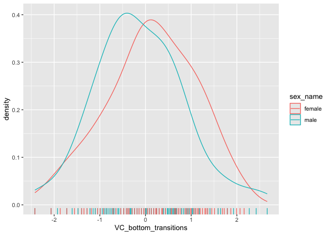
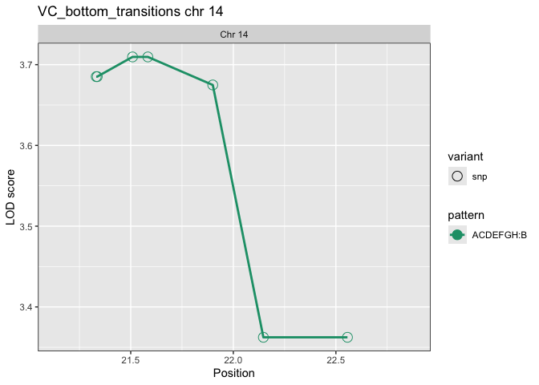
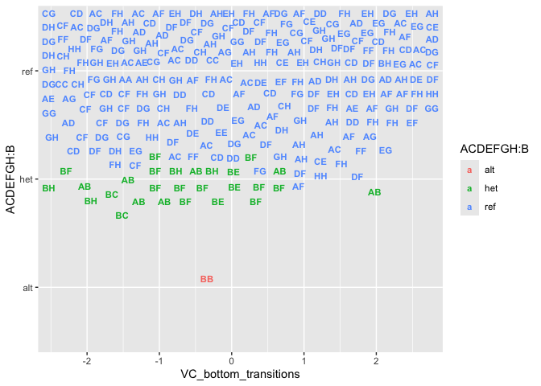
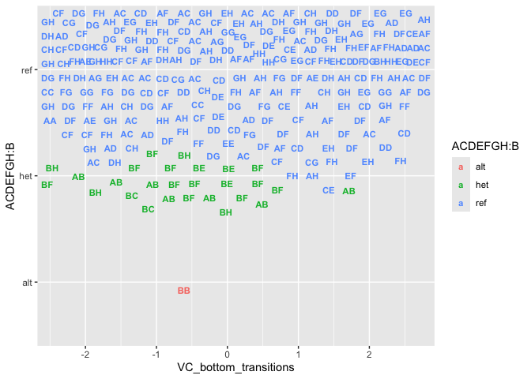

## Example Use

### Read Data

The data sit in a folder, say `qtl2shinyData`, with a file
`projects.csv` that looks like

<table>
<thead>
<tr>
<th style="text-align: left;">project</th>
<th style="text-align: left;">taxa</th>
<th style="text-align: left;">directory</th>
</tr>
</thead>
<tbody>
<tr>
<td style="text-align: left;">Recla</td>
<td style="text-align: left;">CCmouse</td>
<td style="text-align: left;">qtl2shinyData</td>
</tr>
</tbody>
</table>

The canonical data is `Recla`, which can be found at
[github.com/rqtl/qtl2data/DO\_Recla2](https://github.com/rqtl/qtl2data/tree/main/DO_Recla2).

Set up `project_df` dataframe. See
[projectServer()](https://github.com/byandell-sysgen/qtl2shiny/blob/master/R/projectApp.R).

    dir()

    ##  [1] "about-extended.md"  "about.md"           "app_legacy.R"      
    ##  [4] "app.R"              "DO1200Data.html"    "DO1200Data.md"     
    ##  [7] "DO1200Data.Rmd"     "DO1200Study.Rmd"    "doc"               
    ## [10] "LICENSE"            "qtl2shinyApp.Rproj" "qtl2shinyData"     
    ## [13] "ReadMe_RD.html"     "ReadMe_RD.md"       "README.md"         
    ## [16] "Recla.html"         "Recla.Rmd"          "scan_lipid_obj.rds"
    ## [19] "transition.Rmd"     "workflow.md"

    datadir <- "qtl2shinyData"
    project_df <- read.csv(file.path(datadir, "projects.csv")) |>
      dplyr::filter(project == "Recla")
    project_df

    ##   project    taxa     directory
    ## 1   Recla CCmouse qtl2shinyData

The following are set up in
[setParServer()](https://github.com/byandell-sysgen/qtl2shiny/blob/master/R/setParApp.R).

    (project_class <- qtl2shiny::project_classes(project_df))

    ## [1] "group"

    (subject_model <- qtl2shiny::project_subject_model(project_df, project_class))

    ## [1] "all_mice_additive"

    (window_Mbp <- 1)

    ## [1] 1

Read peaks in
[peakReadServer()](https://github.com/byandell-sysgen/qtl2shiny/blob/master/R/peakReadApp.R).

    (peak_read_df <- qtl2shiny::read_peaks(project_df, project_class[1],
                            subject_model = subject_model[1]))

    ## # A tibble: 450 × 10
    ##    phenotype_class phenotype          qtl_lod qtl_chr qtl_pos addcovar  intcovar
    ##    <chr>           <chr>                <dbl> <fct>     <dbl> <chr>     <chr>   
    ##  1 group           OF_distance_first4    5.25 1          84.1 ~sex+Coh… none    
    ##  2 group           OF_distance_first4    5.67 2         116.  ~sex+Coh… none    
    ##  3 group           OF_distance_first4    6.55 3          26.5 ~sex+Coh… none    
    ##  4 group           OF_distance_first4    3.65 4          21.7 ~sex+Coh… none    
    ##  5 group           OF_distance_first4    5.03 5         128.  ~sex+Coh… none    
    ##  6 group           OF_distance_first4    3.96 6         139.  ~sex+Coh… none    
    ##  7 group           OF_distance_first4    5.18 7         111.  ~sex+Coh… none    
    ##  8 group           OF_distance_first4    4.11 8          26.8 ~sex+Coh… none    
    ##  9 group           OF_distance_first4    3.18 9          65.2 ~sex+Coh… none    
    ## 10 group           OF_distance_first4    5.06 10        128.  ~sex+Coh… none    
    ## # ℹ 440 more rows
    ## # ℹ 3 more variables: phenotype_original <chr>, subject <chr>, model <chr>

### Hotspots and Phenotypes

The
[hotspotServer()](https://github.com/byandell-sysgen/qtl2shiny/blob/master/R/hotspotApp.R)
includes several steps for hotspots and phenotypes.

#### Hotspots

Create hotspots in
[hotspotDataServer()](https://github.com/byandell-sysgen/qtl2shiny/blob/master/R/hotspotDataApp.R).

    pmap_obj <- qtl2shiny::read_project(project_df, "pmap")
    sapply(pmap_obj, length)

    ##   1   2   3   4   5   6   7   8   9  10  11  12  13  14  15  16  17  18  19   X 
    ## 537 544 469 452 438 447 428 376 388 430 394 356 363 369 303 300 270 261 196 442

    minLOD <- 3
    hotspot_obj <- qtl2shiny:::hotspot(pmap_obj, peak_read_df, window_Mbp, minLOD,
                                       chrs = NULL)
    names(hotspot_obj)

    ## [1] "scan" "map"

Display `hotspot_df` in
[hotspotTableServer()](https://github.com/byandell-sysgen/qtl2shiny/blob/master/R/hotspotTableApp.R).

    (hotspot_df <- summary(hotspot_obj))

    ## # A tibble: 20 × 4
    ##    hotspot    chr     pos group
    ##    <chr>      <fct> <dbl> <dbl>
    ##  1 14:22 (11) 14       22    11
    ##  2 11:97 (8)  11       97     8
    ##  3 19:5 (8)   19        5     8
    ##  4 5:38 (7)   5        38     7
    ##  5 12:99 (7)  12       99     7
    ##  6 13:110 (7) 13      110     7
    ##  7 16:33 (6)  16       33     6
    ##  8 18:32 (6)  18       32     6
    ##  9 1:124 (5)  1       124     5
    ## 10 6:110 (5)  6       110     5
    ## 11 9:70 (5)   9        70     5
    ## 12 10:116 (5) 10      116     5
    ## 13 15:32 (5)  15       32     5
    ## 14 2:115 (4)  2       115     4
    ## 15 7:139 (4)  7       139     4
    ## 16 3:26 (3)   3        26     3
    ## 17 4:140 (3)  4       140     3
    ## 18 8:77 (3)   8        77     3
    ## 19 17:66 (3)  17       66     3
    ## 20 X:6 (1)    X         6     1

Plot `hotspot_obj` in
[hotspotPlotServer()](https://github.com/byandell-sysgen/qtl2shiny/blob/master/R/hotspotPlotApp.R).

    qtl2shiny:::plot_hot(hotspot_obj, project_class, window_Mbp)

The window parameter are in
[winParServer()](https://github.com/byandell-sysgen/qtl2shiny/blob/master/R/winParApp.R).

    (hotspot <- hotspot_df$hotspot[1])

    ## [1] "14:22 (11)"

    (chr_id <- as.character(hotspot_df$chr[1]))

    ## [1] "14"

    (peak_Mbp <- hotspot_df$pos[1])

    ## [1] 22

    (hotspot_count <- hotspot_df$group[1])

    ## [1] 11

Peak dataframe is now refined with
[peakServer()](https://github.com/byandell-sysgen/qtl2shiny/blob/master/R/peakApp.R).

    (peak_df <- qtl2shiny:::peaks_in_pos(peak_read_df, TRUE,
      chr_id = chr_id, pos_Mbp = peak_Mbp, win = window_Mbp))

    ## # A tibble: 11 × 10
    ##    phenotype phenotype_original phenotype_class qtl_lod qtl_chr qtl_pos addcovar
    ##    <chr>     <chr>              <chr>             <dbl> <fct>     <dbl> <chr>   
    ##  1 VC_botto… VC_bottom_transit… group               7.1 14         22.8 ~sex+Co…
    ##  2 VC_botto… VC_bottom_distance group               6.4 14         22.8 ~sex+Co…
    ##  3 VC_top_v… VC_top_velocity    group               5.8 14         22.9 ~sex+Co…
    ##  4 LD_light… LD_light_pct       group               5.3 14         22.9 ~sex+Co…
    ##  5 VC_top_t… VC_top_time_pct    group               5.1 14         22.8 ~sex+Co…
    ##  6 VC_botto… VC_bottom_time_pct group               5.1 14         22.8 ~sex+Co…
    ##  7 LD_dista… LD_distance_light  group               5   14         22.9 ~sex+Co…
    ##  8 VC_top_t… VC_top_time_first4 group               4.2 14         22.9 ~sex+Co…
    ##  9 VC_botto… VC_bottom_time_fi… group               3.9 14         22.9 ~sex+Co…
    ## 10 VC_botto… VC_bottom_distanc… group               3.9 14         22.9 ~sex+Co…
    ## 11 HP_laten… HP_latency         group               3.2 14         21.8 ~sex+Co…
    ## # ℹ 3 more variables: intcovar <chr>, subject <chr>, model <chr>

#### Phenotypes

Phenotypes are determined with
[phenoServer()](https://github.com/byandell-sysgen/qtl2shiny/blob/master/R/phenoApp.R),
which in itself has several steps

    covar_df <- qtl2shiny::read_project(project_df, "covar")

Phenotype names are pulled from `peak_df` with
[phenoNamesServer()](https://github.com/byandell-sysgen/qtl2shiny/blob/master/R/phenoNamesApp.R),

    (pheno_names <- peak_df$phenotype)

    ##  [1] "VC_bottom_transitions"     "VC_bottom_distance"       
    ##  [3] "VC_top_velocity"           "LD_light_pct"             
    ##  [5] "VC_top_time_pct"           "VC_bottom_time_pct"       
    ##  [7] "LD_distance_light"         "VC_top_time_first4"       
    ##  [9] "VC_bottom_time_first4"     "VC_bottom_distance_first4"
    ## [11] "HP_latency"

    pheno_name <- pheno_names[1]

Read phenotype data with
[phenoReadServer()](https://github.com/byandell-sysgen/qtl2shiny/blob/master/R/phenoReadApp.R),

    pheno_read_mx <- qtl2shiny::read_pheno(project_df, project_class, columns = pheno_names,
                     peak_df = peak_df)

Rankz-transform phenotype data for `pheno_name` with
[phenoDataServer()](https://github.com/byandell-sysgen/qtl2shiny/blob/master/R/phenoDataApp.R),

    pheno_mx <- qtl2shiny:::pheno_rankz(pheno_read_mx[, pheno_name, drop = FALSE])

Display summary table with
[phenoTableServer()](https://github.com/byandell-sysgen/qtl2shiny/blob/master/R/phenoTableApp.R).

    qtl2shiny:::summary_na(pheno_mx, covar_df)

    ## # A tibble: 2 × 5
    ##   phenotype             sex      mean    sd    na
    ##   <chr>                 <chr>   <dbl> <dbl> <int>
    ## 1 VC_bottom_transitions female  0.128 0.984     2
    ## 2 VC_bottom_transitions male   -0.136 0.965     1

Plot phenotypes with
[phenoPlotServer()](https://github.com/byandell-sysgen/qtl2shiny/blob/master/R/phenoPlotApp.R).

    qtl2shiny:::plot_sex(pheno_mx, covar_df)

 \###
Allele and SNP Scans

Allele and SNP scans are performed with
[scanServer()](https://github.com/byandell-sysgen/qtl2shiny/blob/master/R/scanApp.R).

#### Allele Scan

The first step is to set up the `probs_obj` with
[probsServer()](https://github.com/byandell-sysgen/qtl2shiny/blob/master/R/probsApp.R).

    dir()

    ##  [1] "about-extended.md"  "about.md"           "app_legacy.R"      
    ##  [4] "app.R"              "DO1200Data.html"    "DO1200Data.md"     
    ##  [7] "DO1200Data.Rmd"     "DO1200Study.Rmd"    "doc"               
    ## [10] "LICENSE"            "qtl2shinyApp.Rproj" "qtl2shinyData"     
    ## [13] "ReadMe_RD.html"     "ReadMe_RD.md"       "README.md"         
    ## [16] "Recla.html"         "Recla.Rmd"          "scan_lipid_obj.rds"
    ## [19] "transition.Rmd"     "workflow.md"

\*\* problem in qtl2pattern:::read\_probs `chr` may factor and needs

    query_probs <- qtl2shiny:::read_query_rds(project_df, "query_probs.rds")
    start_val <- peak_Mbp - window_Mbp
    end_val <- peak_Mbp + window_Mbp
    probs_obj <- query_probs(chr_id, start_val, end_val)

Also need \`kinship\_list from
[kinshipServer()](https://github.com/byandell-sysgen/qtl2shiny/blob/master/R/kinshipApp.R).

    kinship_list <- qtl2shiny::read_project(project_df, "kinship")[chr_id]

The traditional allele (genome) scan is done with
[scanDataServer()](https://github.com/byandell-sysgen/qtl2shiny/blob/master/R/scanDataApp.R).

    scan_obj <- qtl2shiny::scan1covar(pheno_mx, covar_df, probs_obj$probs,
                                       kinship_list, peak_df)

    scan_window <- range(probs_obj$map[[chr_id]])
    print(qtl2shiny:::plot_scan(scan_obj, probs_obj$map, seq(ncol(scan_obj)),
                                chr_id, scan_window, pheno_mx))

    summary(scan_obj, probs_obj$map)

    ## # A tibble: 1 × 5
    ##   pheno                 chr     pos marker      lod
    ##   <chr>                 <fct> <dbl> <chr>     <dbl>
    ## 1 VC_bottom_transitions 14     22.8 c14.loc13  7.92

    eff_obj <- qtl2shiny:::scan1_effect(probs_obj$probs, pheno_mx, kinship_list,
                                        covar_df, peak_df, blups = FALSE)

    allele_info <- qtl2shiny::read_project(project_df, "allele_info")

    qtl2shiny:::plot_eff(pheno_name, eff_obj, probs_obj$map, scan_obj, scan_window,,
                         allele_info)

#### SNP Scans

SNP scans (SNP association maps) are done with
[snpGeneServer()](https://github.com/byandell-sysgen/qtl2shiny/blob/master/R/snpGeneApp.R).

##### SNP Internal List

This requires a list of objects `snp_list` created with
[snpListServer()](https://github.com/byandell-sysgen/qtl2shiny/blob/master/R/snpListApp.R).

The `snp_par` parameters are those already set above. In the shiny app,
some can be modified in later sub-panels.

There are two ways to set up SNP probabilities, using the allele pairs
or directly using recomputed SNP probabilities. \*\* The
`qtl2shiny::snpProbsServer()` uses `qtl2pattern:::read_probs()` with
`allelle = FALSE` (allele pairs) instead of `allele = "SNP"`. It should
check to see if the `snpprobs_fstindex.rds` exists. Need to also check
that this object has the `snpinfo` or if we need to get it from SNP
variants and add columns.\*\*

Currently, Recla is not set up to use precomputed SNP probabilities.

    # `query_probs` defined above for traditional allele scans.
    pair_probs_obj <- query_probs(chr_id, start_val, end_val, allele = FALSE)
    # define the query_variants function
    query_variants <- qtl2shiny:::read_query_rds(project_df, "query_variants.rds")
    snpinfo <- query_variants(chr_id, start_val, end_val)
    snpprobs_obj <- qtl2mediate::get_snpprobs(chr_id, peak_Mbp, window_Mbp,
      pheno_names, pair_probs_obj$probs, pair_probs_obj$map, snpinfo)
    snpinfo <- snpprobs_obj$snpinfo

The `snpinfo` object is needed for other panels. The `snpprobs_obj` is
only used below inside this panel to create other objects passed along
via `snp_list`.

    snp_scan_obj <- qtl2shiny::scan1covar(pheno_mx, covar_df,
      snpprobs_obj$snpprobs, kinship_list, peak_df)

    drop_hilit <- max(unclass(snp_scan_obj)) - minLOD
    top_snps_tbl <- qtl2pattern::top_snps_pattern(snp_scan_obj, snpinfo, drop_hilit)

    gene_exon_tbl <- qtl2shiny:::gene_exons(top_snps_tbl, project_df)

    (patterns <- qtl2shiny:::top_patterns(top_snps_tbl))

    ## # A tibble: 1 × 9
    ##   pheno            min_pos max_pos max_lod min_lod   sdp pattern snp_id contrast
    ##   <chr>              <dbl>   <dbl>   <dbl>   <dbl> <dbl> <chr>   <chr>  <chr>   
    ## 1 VC_bottom_trans…    21.5    21.6    3.71    3.36     2 ACDEFG… 7 SNPs basic

#### SNP Summaries

SNP summaries
[snpPlotServer()](https://github.com/byandell-sysgen/qtl2shiny/blob/master/R/snpPlotApp.R)
and
[snpTableServer()](https://github.com/byandell-sysgen/qtl2shiny/blob/master/R/snpTableApp.R).

    print(qtl2shiny:::top_snp_asso(snp_scan_obj, snpinfo, scan_window, "basic", minLOD))

    qtl2shiny:::ensembl_gene(summary(top_snps_tbl,"best"), project_df, TRUE)

    ## # A tibble: 2 × 20
    ##   pheno    chr     pos   lod snp_id   sdp alleles ensembl_gene consequence   A_J
    ##   <chr>    <chr> <dbl> <dbl> <chr>  <dbl> <chr>   <chr>        <chr>       <dbl>
    ## 1 VC_bott… 14     21.5  3.71 rs522…     2 G|A     "<a href=\"… intrn_vrnt…     1
    ## 2 VC_bott… 14     21.6  3.71 rs313…     2 G|A     "<a href=\"… intrn_vrnt…     1
    ## # ℹ 10 more variables: C57BL_6J <dbl>, `129S1_SvImJ` <dbl>, NOD_ShiLtJ <dbl>,
    ## #   NZO_HlLtJ <dbl>, CAST_EiJ <dbl>, PWK_PhJ <dbl>, WSB_EiJ <dbl>, type <chr>,
    ## #   interval <int>, on_map <lgl>

#### Genes and Exons

Genes and exons are handled by
[geneRegionServer()](https://github.com/byandell-sysgen/qtl2shiny/blob/master/R/geneRegionApp.R)
and
[geneExonServer()](https://github.com/byandell-sysgen/qtl2shiny/blob/master/R/geneExonApp.R).

    (gene_region_tbl <- qtl2shiny:::gene_region(chr_id, scan_window, project_df))

    ##    chr source       type    start     stop score strand phase              ID
    ## 1   14    MGI       gene 21.05257 21.44857    NA      +    NA   MGI:MGI:87930
    ## 2   14    MGI       gene 21.20567 21.20919    NA   <NA>    NA MGI:MGI:2442823
    ## 3   14    MGI       gene 21.20567 21.20919    NA   <NA>    NA MGI:MGI:2442823
    ## 4   14    MGI       gene 21.26362 21.26386    NA      +    NA MGI:MGI:5456149
    ## 5   14    MGI       gene 21.27045 21.27336    NA   <NA>    NA MGI:MGI:2443683
    ## 6   14    MGI       gene 21.27045 21.27336    NA   <NA>    NA MGI:MGI:2443683
    ## 7   14    MGI       gene 21.27045 21.27336    NA   <NA>    NA MGI:MGI:2443683
    ## 8   14    MGI       gene 21.44926 21.48565    NA      -    NA MGI:MGI:5589522
    ## 9   14    MGI       gene 21.45047 21.45057    NA      +    NA MGI:MGI:5455641
    ## 10  14    MGI       gene 21.48143 21.67248    NA      +    NA MGI:MGI:1858746
    ## 11  14    MGI       gene 21.67621 21.71458    NA      -    NA MGI:MGI:3647127
    ## 12  14    MGI       gene 21.73339 21.75118    NA      -    NA MGI:MGI:1351599
    ## 13  14    MGI       gene 21.74154 21.74663    NA      +    NA MGI:MGI:3801894
    ## 14  14    MGI       gene 21.75053 21.79873    NA      +    NA MGI:MGI:1914880
    ## 15  14    MGI       gene 21.81271 21.81285    NA      +    NA MGI:MGI:5453279
    ## 16  14    MGI       gene 21.83127 21.84588    NA      +    NA  MGI:MGI:106915
    ## 17  14    MGI       gene 21.84586 21.84898    NA      -    NA MGI:MGI:1916406
    ## 18  14    MGI       gene 21.84744 21.85693    NA      +    NA MGI:MGI:2442125
    ## 19  14    MGI       gene 21.86863 21.86876    NA   <NA>    NA MGI:MGI:1918242
    ## 20  14    MGI       gene 21.86863 21.86876    NA   <NA>    NA MGI:MGI:1918242
    ## 21  14    MGI       gene 21.93210 21.95240    NA      +    NA MGI:MGI:5610818
    ## 22  14    MGI       gene 21.98396 21.98960    NA      -    NA MGI:MGI:1353644
    ## 23  14    MGI       gene 21.98980 21.99857    NA      +    NA MGI:MGI:2145684
    ## 24  14    MGI       gene 21.99062 21.99113    NA   <NA>    NA MGI:MGI:3026987
    ## 25  14    MGI       gene 21.99062 21.99113    NA   <NA>    NA MGI:MGI:3026987
    ## 26  14    MGI       gene 21.99062 21.99113    NA   <NA>    NA MGI:MGI:3026987
    ## 27  14    MGI       gene 22.01378 22.01881    NA      +    NA MGI:MGI:5623991
    ## 28  14    MGI       gene 22.01950 23.05609    NA      +    NA MGI:MGI:1923883
    ## 29  14    MGI       gene 22.02196 22.02207    NA      -    NA MGI:MGI:5530914
    ## 30  14    MGI       gene 22.03124 22.06076    NA      +    NA MGI:MGI:5623992
    ## 31  14    MGI       gene 22.03208 22.03610    NA   <NA>    NA MGI:MGI:3648577
    ## 32  14    MGI       gene 22.40113 22.40293    NA   <NA>    NA MGI:MGI:1921724
    ## 33  14    MGI       gene 22.50717 22.54280    NA      -    NA MGI:MGI:1921060
    ## 34  14    MGI pseudogene 22.55800 22.56093    NA      -    NA MGI:MGI:3647128
    ## 35  14    MGI       gene 22.72900 22.80187    NA      -    NA MGI:MGI:5590085
    ## 36  14    MGI pseudogene 22.77457 22.77548    NA      -    NA MGI:MGI:3645547
    ##             Name Parent
    ## 1            Adk   <NA>
    ## 2  B130016H12Rik   <NA>
    ## 3  B130016H12Rik   <NA>
    ## 4        Gm26372   <NA>
    ## 5  A430108C13Rik   <NA>
    ## 6  A430108C13Rik   <NA>
    ## 7  A430108C13Rik   <NA>
    ## 8        Gm30363   <NA>
    ## 9        Gm25864   <NA>
    ## 10         Kat6b   <NA>
    ## 11         Dupd1   <NA>
    ## 12        Dusp13   <NA>
    ## 13       Gm15935   <NA>
    ## 14         Samd8   <NA>
    ## 15       Gm23502   <NA>
    ## 16         Vdac2   <NA>
    ## 17        Comtd1   <NA>
    ## 18 A430057M04Rik   <NA>
    ## 19 4931407E12Rik   <NA>
    ## 20 4931407E12Rik   <NA>
    ## 21       Gm37590   <NA>
    ## 22        Zfp503   <NA>
    ## 23 C130012C08Rik   <NA>
    ## 24 A330001L22Rik   <NA>
    ## 25 A330001L22Rik   <NA>
    ## 26 A330001L22Rik   <NA>
    ## 27       Gm41106   <NA>
    ## 28         Lrmda   <NA>
    ## 29       Gm27532   <NA>
    ## 30       Gm41107   <NA>
    ## 31        Gm7480   <NA>
    ## 32 5230400M06Rik   <NA>
    ## 33 4930405A10Rik   <NA>
    ## 34        Gm5670   <NA>
    ## 35       Gm30926   <NA>
    ## 36        Gm7473   <NA>
    ##                                                                    Dbxref
    ## 1                              NCBI_Gene:11534,ENSEMBL:ENSMUSG00000039197
    ## 2                                                        GenBank:AK044964
    ## 3                                                        GenBank:AK042085
    ## 4                                              ENSEMBL:ENSMUSG00000088456
    ## 5                                                        GenBank:AK040593
    ## 6                                                        GenBank:AK041229
    ## 7                                                        GenBank:AK135511
    ## 8                                                     NCBI_Gene:102632228
    ## 9                                              ENSEMBL:ENSMUSG00000088873
    ## 10     VEGA:OTTMUSG00000043207,NCBI_Gene:54169,ENSEMBL:ENSMUSG00000021767
    ## 11                            NCBI_Gene:435391,ENSEMBL:ENSMUSG00000063821
    ## 12     VEGA:OTTMUSG00000027823,NCBI_Gene:27389,ENSEMBL:ENSMUSG00000021768
    ## 13                     VEGA:OTTMUSG00000027979,ENSEMBL:ENSMUSG00000084940
    ## 14     VEGA:OTTMUSG00000027978,NCBI_Gene:67630,ENSEMBL:ENSMUSG00000021770
    ## 15                                             ENSEMBL:ENSMUSG00000065836
    ## 16     VEGA:OTTMUSG00000016381,NCBI_Gene:22334,ENSEMBL:ENSMUSG00000021771
    ## 17     VEGA:OTTMUSG00000029118,NCBI_Gene:69156,ENSEMBL:ENSMUSG00000021773
    ## 18    VEGA:OTTMUSG00000036774,NCBI_Gene:319486,ENSEMBL:ENSMUSG00000090564
    ## 19                                                       GenBank:AV271937
    ## 20                                                       GenBank:AK016440
    ## 21                     VEGA:OTTMUSG00000047340,ENSEMBL:ENSMUSG00000104232
    ## 22    VEGA:OTTMUSG00000036886,NCBI_Gene:218820,ENSEMBL:ENSMUSG00000039081
    ## 23 VEGA:OTTMUSG00000042993,NCBI_Gene:102632594,ENSEMBL:ENSMUSG00000103160
    ## 24                                                       GenBank:AK039230
    ## 25                                                       GenBank:BB183877
    ## 26                                                       GenBank:AI316854
    ## 27                                                    NCBI_Gene:105245694
    ## 28     VEGA:OTTMUSG00000034628,NCBI_Gene:76633,ENSEMBL:ENSMUSG00000063458
    ## 29                                             ENSEMBL:ENSMUSG00000098542
    ## 30                                                    NCBI_Gene:105245695
    ## 31                                                       GenBank:AK086481
    ## 32                                                       GenBank:AK017228
    ## 33                                                        NCBI_Gene:74896
    ## 34                         NCBI_Gene:101055805,ENSEMBL:ENSMUSG00000059827
    ## 35                                                    NCBI_Gene:102632991
    ## 36                                                       NCBI_Gene:665068
    ##                                                               mgiName
    ## 1                                                    adenosine kinase
    ## 2                                          RIKEN cDNA B130016H12 gene
    ## 3                                          RIKEN cDNA B130016H12 gene
    ## 4                                             predicted gene%2c 26372
    ## 5                                          RIKEN cDNA A430108C13 gene
    ## 6                                          RIKEN cDNA A430108C13 gene
    ## 7                                          RIKEN cDNA A430108C13 gene
    ## 8                                             predicted gene%2c 30363
    ## 9                                             predicted gene%2c 25864
    ## 10                                     K(lysine) acetyltransferase 6B
    ## 11 dual specificity phosphatase and pro isomerase domain containing 1
    ## 12                                    dual specificity phosphatase 13
    ## 13                                               predicted gene 15935
    ## 14                            sterile alpha motif domain containing 8
    ## 15                                            predicted gene%2c 23502
    ## 16                                  voltage-dependent anion channel 2
    ## 17                   catechol-O-methyltransferase domain containing 1
    ## 18                                         RIKEN cDNA A430057M04 gene
    ## 19                                         RIKEN cDNA 4931407E12 gene
    ## 20                                         RIKEN cDNA 4931407E12 gene
    ## 21                                            predicted gene%2c 37590
    ## 22                                            zinc finger protein 503
    ## 23                                         RIKEN cDNA C130012C08 gene
    ## 24                                         RIKEN cDNA A330001L22 gene
    ## 25                                         RIKEN cDNA A330001L22 gene
    ## 26                                         RIKEN cDNA A330001L22 gene
    ## 27                                            predicted gene%2c 41106
    ## 28                 leucine rich melanocyte differentiation associated
    ## 29                                            predicted gene%2c 27532
    ## 30                                            predicted gene%2c 41107
    ## 31                                                predicted gene 7480
    ## 32                                         RIKEN cDNA 5230400M06 gene
    ## 33                                         RIKEN cDNA 4930405A10 gene
    ## 34                                                predicted gene 5670
    ## 35                                            predicted gene%2c 30926
    ## 36                                                predicted gene 7473
    ##                             bioType Alias
    ## 1               protein coding gene  <NA>
    ## 2                 unclassified gene  <NA>
    ## 3                 unclassified gene  <NA>
    ## 4  unclassified non-coding RNA gene  <NA>
    ## 5                 unclassified gene  <NA>
    ## 6                 unclassified gene  <NA>
    ## 7                 unclassified gene  <NA>
    ## 8                       lncRNA gene  <NA>
    ## 9                        snRNA gene  <NA>
    ## 10              protein coding gene  <NA>
    ## 11              protein coding gene  <NA>
    ## 12              protein coding gene  <NA>
    ## 13            antisense lncRNA gene  <NA>
    ## 14              protein coding gene  <NA>
    ## 15                       snRNA gene  <NA>
    ## 16              protein coding gene  <NA>
    ## 17              protein coding gene  <NA>
    ## 18 unclassified non-coding RNA gene  <NA>
    ## 19                unclassified gene  <NA>
    ## 20                unclassified gene  <NA>
    ## 21                unclassified gene  <NA>
    ## 22              protein coding gene  <NA>
    ## 23                      lncRNA gene  <NA>
    ## 24                unclassified gene  <NA>
    ## 25                unclassified gene  <NA>
    ## 26                unclassified gene  <NA>
    ## 27                      lncRNA gene  <NA>
    ## 28              protein coding gene  <NA>
    ## 29                       miRNA gene  <NA>
    ## 30                      lncRNA gene  <NA>
    ## 31                unclassified gene  <NA>
    ## 32                unclassified gene  <NA>
    ## 33                      lncRNA gene  <NA>
    ## 34                       pseudogene  <NA>
    ## 35                      lncRNA gene  <NA>
    ## 36                       pseudogene  <NA>

    print(qtl2shiny:::plot_gene_region(pheno_name, gene_region_tbl, top_snps_tbl, 
                                       scan_window, use_snp = TRUE, "basic"))

    (exon_table <- summary(gene_exon_tbl, top_snps_tbl = top_snps_tbl))

    ## # A tibble: 3 × 10
    ##   gene  max_lod exons strand min_Mbp max_Mbp   min.len  max.len sum.len
    ##   <chr>   <dbl> <int> <chr>    <dbl>   <dbl>     <dbl>    <dbl>   <dbl>
    ## 1 Kat6b    3.71    57 +         21.5    21.7 0.0000220 0.00430  0.0552 
    ## 2 Lrmda    3.36    10 +         22.0    22.4 0.0000600 0.0283   0.0310 
    ## 3 Adk     NA        5 +         21.4    21.4 0.0000350 0.000755 0.00174
    ## # ℹ 1 more variable: VC_bottom_transitions <dbl>

    gene_names <- exon_table$gene

    (gene_exon_pheno <- subset(gene_exon_tbl, gene_names[1]))

    ##     gene chr    source type    start     stop score strand phase
    ## 1  Kat6b  14      VEGA exon 21.48143 21.48155    NA      +    NA
    ## 2  Kat6b  14       MGI gene 21.48143 21.67248    NA      +    NA
    ## 3  Kat6b  14      VEGA exon 21.48146 21.48155    NA      +    NA
    ## 4  Kat6b  14 NCBI_Gene exon 21.49881 21.49965    NA      +    NA
    ## 5  Kat6b  14 NCBI_Gene exon 21.49971 21.49996    NA      +    NA
    ## 6  Kat6b  14      VEGA exon 21.49977 21.49982    NA      +    NA
    ## 7  Kat6b  14 NCBI_Gene exon 21.49978 21.49996    NA      +    NA
    ## 8  Kat6b  14      VEGA exon 21.49985 21.49996    NA      +    NA
    ## 9  Kat6b  14      VEGA exon 21.49987 21.49996    NA      +    NA
    ## 10 Kat6b  14 NCBI_Gene exon 21.50044 21.50108    NA      +    NA
    ## 11 Kat6b  14 NCBI_Gene exon 21.50044 21.50108    NA      +    NA
    ## 12 Kat6b  14 NCBI_Gene exon 21.50045 21.50108    NA      +    NA
    ## 13 Kat6b  14 NCBI_Gene exon 21.50045 21.50108    NA      +    NA
    ## 14 Kat6b  14 NCBI_Gene exon 21.50045 21.50108    NA      +    NA
    ## 15 Kat6b  14      VEGA exon 21.50085 21.50108    NA      +    NA
    ## 16 Kat6b  14      VEGA exon 21.50089 21.50108    NA      +    NA
    ## 17 Kat6b  14      VEGA exon 21.50089 21.50108    NA      +    NA
    ## 18 Kat6b  14      VEGA exon 21.50089 21.50108    NA      +    NA
    ## 19 Kat6b  14      VEGA exon 21.51663 21.51711    NA      +    NA
    ## 20 Kat6b  14      VEGA exon 21.51663 21.51750    NA      +    NA
    ## 21 Kat6b  14      VEGA exon 21.51663 21.51864    NA      +    NA
    ## 22 Kat6b  14      VEGA exon 21.51663 21.52030    NA      +    NA
    ## 23 Kat6b  14   ENSEMBL exon 21.51675 21.51728    NA      +    NA
    ## 24 Kat6b  14      VEGA exon 21.53026 21.53036    NA      +    NA
    ## 25 Kat6b  14 NCBI_Gene exon 21.55762 21.55883    NA      +    NA
    ## 26 Kat6b  14      VEGA exon 21.60975 21.60986    NA      +    NA
    ## 27 Kat6b  14      VEGA exon 21.61889 21.61901    NA      +    NA
    ## 28 Kat6b  14      VEGA exon 21.61889 21.61901    NA      +    NA
    ## 29 Kat6b  14      VEGA exon 21.61922 21.61930    NA      +    NA
    ## 30 Kat6b  14      VEGA exon 21.61922 21.62061    NA      +    NA
    ## 31 Kat6b  14      VEGA exon 21.61922 21.62140    NA      +    NA
    ## 32 Kat6b  14      VEGA exon 21.62195 21.62198    NA      +    NA
    ## 33 Kat6b  14      VEGA exon 21.62195 21.62209    NA      +    NA
    ## 34 Kat6b  14      VEGA exon 21.62196 21.62209    NA      +    NA
    ## 35 Kat6b  14      VEGA exon 21.62254 21.62684    NA      +    NA
    ## 36 Kat6b  14 NCBI_Gene exon 21.62255 21.62684    NA      +    NA
    ## 37 Kat6b  14      VEGA exon 21.62483 21.62489    NA      +    NA
    ## 38 Kat6b  14      VEGA exon 21.62483 21.62522    NA      +    NA
    ## 39 Kat6b  14      VEGA exon 21.62483 21.62554    NA      +    NA
    ## 40 Kat6b  14 NCBI_Gene exon 21.62483 21.62576    NA      +    NA
    ## 41 Kat6b  14      VEGA exon 21.62672 21.62684    NA      +    NA
    ## 42 Kat6b  14      VEGA exon 21.62881 21.62893    NA      +    NA
    ## 43 Kat6b  14      VEGA exon 21.63132 21.63146    NA      +    NA
    ## 44 Kat6b  14      VEGA exon 21.63448 21.63459    NA      +    NA
    ## 45 Kat6b  14      VEGA exon 21.63448 21.63464    NA      +    NA
    ## 46 Kat6b  14      VEGA exon 21.63755 21.63764    NA      +    NA
    ## 47 Kat6b  14 NCBI_Gene exon 21.65788 21.65796    NA      +    NA
    ## 48 Kat6b  14      VEGA exon 21.66074 21.66097    NA      +    NA
    ## 49 Kat6b  14      VEGA exon 21.66143 21.66159    NA      +    NA
    ## 50 Kat6b  14      VEGA exon 21.66216 21.66247    NA      +    NA
    ## 51 Kat6b  14      VEGA exon 21.66446 21.66475    NA      +    NA
    ## 52 Kat6b  14 NCBI_Gene exon 21.66833 21.67172    NA      +    NA
    ## 53 Kat6b  14      VEGA exon 21.66833 21.67207    NA      +    NA
    ## 54 Kat6b  14      VEGA exon 21.66833 21.67213    NA      +    NA
    ## 55 Kat6b  14 NCBI_Gene exon 21.66833 21.67248    NA      +    NA
    ## 56 Kat6b  14      VEGA exon 21.66833 21.67248    NA      +    NA
    ## 57 Kat6b  14 NCBI_Gene exon 21.66833 21.67248    NA      +    NA
    ## 58 Kat6b  14   ENSEMBL exon 21.67074 21.67121    NA      +    NA
    ##                 ID  Name                     Parent
    ## 1             <NA>  <NA>    VEGA:OTTMUST00000113321
    ## 2  MGI:MGI:1858746 Kat6b                       <NA>
    ## 3             <NA>  <NA>    VEGA:OTTMUST00000113322
    ## 4             <NA>  <NA>   NCBI_Gene:XM_006519265.3
    ## 5             <NA>  <NA>   NCBI_Gene:XM_006519264.3
    ## 6             <NA>  <NA>    VEGA:OTTMUST00000113317
    ## 7             <NA>  <NA>      NCBI_Gene:NM_017479.3
    ## 8             <NA>  <NA>    VEGA:OTTMUST00000113318
    ## 9             <NA>  <NA>    VEGA:OTTMUST00000113316
    ## 10            <NA>  <NA>   NCBI_Gene:XM_017316082.1
    ## 11            <NA>  <NA>   NCBI_Gene:XM_006519263.3
    ## 12            <NA>  <NA>   NCBI_Gene:XM_006519268.3
    ## 13            <NA>  <NA>   NCBI_Gene:XM_017316083.1
    ## 14            <NA>  <NA>   NCBI_Gene:XM_017316084.1
    ## 15            <NA>  <NA>    VEGA:OTTMUST00000113323
    ## 16            <NA>  <NA>    VEGA:OTTMUST00000113319
    ## 17            <NA>  <NA>    VEGA:OTTMUST00000113326
    ## 18            <NA>  <NA>    VEGA:OTTMUST00000113320
    ## 19            <NA>  <NA>    VEGA:OTTMUST00000113321
    ## 20            <NA>  <NA>    VEGA:OTTMUST00000113323
    ## 21            <NA>  <NA>    VEGA:OTTMUST00000113318
    ## 22            <NA>  <NA>    VEGA:OTTMUST00000113319
    ## 23            <NA>  <NA> ENSEMBL:ENSMUST00000112458
    ## 24            <NA>  <NA>    VEGA:OTTMUST00000113322
    ## 25            <NA>  <NA>   NCBI_Gene:XM_006519269.3
    ## 26            <NA>  <NA>    VEGA:OTTMUST00000113323
    ## 27            <NA>  <NA>    VEGA:OTTMUST00000113323
    ## 28            <NA>  <NA>    VEGA:OTTMUST00000113326
    ## 29            <NA>  <NA>    VEGA:OTTMUST00000113317
    ## 30            <NA>  <NA>    VEGA:OTTMUST00000113326
    ## 31            <NA>  <NA>    VEGA:OTTMUST00000113323
    ## 32            <NA>  <NA>    VEGA:OTTMUST00000113322
    ## 33            <NA>  <NA>    VEGA:OTTMUST00000113317
    ## 34            <NA>  <NA>    VEGA:OTTMUST00000113324
    ## 35            <NA>  <NA>    VEGA:OTTMUST00000113325
    ## 36            <NA>  <NA>   NCBI_Gene:XM_017316085.1
    ## 37            <NA>  <NA>    VEGA:OTTMUST00000113317
    ## 38            <NA>  <NA>    VEGA:OTTMUST00000113320
    ## 39            <NA>  <NA>    VEGA:OTTMUST00000113324
    ## 40            <NA>  <NA>   NCBI_Gene:XM_006519265.3
    ## 41            <NA>  <NA>    VEGA:OTTMUST00000113317
    ## 42            <NA>  <NA>    VEGA:OTTMUST00000113317
    ## 43            <NA>  <NA>    VEGA:OTTMUST00000113317
    ## 44            <NA>  <NA>    VEGA:OTTMUST00000113325
    ## 45            <NA>  <NA>    VEGA:OTTMUST00000113317
    ## 46            <NA>  <NA>    VEGA:OTTMUST00000113317
    ## 47            <NA>  <NA>   NCBI_Gene:XM_017316085.1
    ## 48            <NA>  <NA>    VEGA:OTTMUST00000113317
    ## 49            <NA>  <NA>    VEGA:OTTMUST00000113317
    ## 50            <NA>  <NA>    VEGA:OTTMUST00000113317
    ## 51            <NA>  <NA>    VEGA:OTTMUST00000113317
    ## 52            <NA>  <NA>   NCBI_Gene:XM_006519265.3
    ## 53            <NA>  <NA>    VEGA:OTTMUST00000113317
    ## 54            <NA>  <NA>    VEGA:OTTMUST00000113316
    ## 55            <NA>  <NA>   NCBI_Gene:XM_017316083.1
    ## 56            <NA>  <NA>    VEGA:OTTMUST00000113320
    ## 57            <NA>  <NA>   NCBI_Gene:XM_017316082.1
    ## 58            <NA>  <NA> ENSEMBL:ENSMUST00000112458
    ##                                                                Dbxref
    ## 1                             MGI:MGI:1858746,VEGA:OTTMUSG00000043207
    ## 2  VEGA:OTTMUSG00000043207,NCBI_Gene:54169,ENSEMBL:ENSMUSG00000021767
    ## 3                             MGI:MGI:1858746,VEGA:OTTMUSG00000043207
    ## 4                                     MGI:MGI:1858746,NCBI_Gene:54169
    ## 5                                     MGI:MGI:1858746,NCBI_Gene:54169
    ## 6                             MGI:MGI:1858746,VEGA:OTTMUSG00000043207
    ## 7                                     MGI:MGI:1858746,NCBI_Gene:54169
    ## 8                             MGI:MGI:1858746,VEGA:OTTMUSG00000043207
    ## 9                             MGI:MGI:1858746,VEGA:OTTMUSG00000043207
    ## 10                                    MGI:MGI:1858746,NCBI_Gene:54169
    ## 11                                    MGI:MGI:1858746,NCBI_Gene:54169
    ## 12                                    MGI:MGI:1858746,NCBI_Gene:54169
    ## 13                                    MGI:MGI:1858746,NCBI_Gene:54169
    ## 14                                    MGI:MGI:1858746,NCBI_Gene:54169
    ## 15                            MGI:MGI:1858746,VEGA:OTTMUSG00000043207
    ## 16                            MGI:MGI:1858746,VEGA:OTTMUSG00000043207
    ## 17                            MGI:MGI:1858746,VEGA:OTTMUSG00000043207
    ## 18                            MGI:MGI:1858746,VEGA:OTTMUSG00000043207
    ## 19                            MGI:MGI:1858746,VEGA:OTTMUSG00000043207
    ## 20                            MGI:MGI:1858746,VEGA:OTTMUSG00000043207
    ## 21                            MGI:MGI:1858746,VEGA:OTTMUSG00000043207
    ## 22                            MGI:MGI:1858746,VEGA:OTTMUSG00000043207
    ## 23                         MGI:MGI:1858746,ENSEMBL:ENSMUSG00000021767
    ## 24                            MGI:MGI:1858746,VEGA:OTTMUSG00000043207
    ## 25                                    MGI:MGI:1858746,NCBI_Gene:54169
    ## 26                            MGI:MGI:1858746,VEGA:OTTMUSG00000043207
    ## 27                            MGI:MGI:1858746,VEGA:OTTMUSG00000043207
    ## 28                            MGI:MGI:1858746,VEGA:OTTMUSG00000043207
    ## 29                            MGI:MGI:1858746,VEGA:OTTMUSG00000043207
    ## 30                            MGI:MGI:1858746,VEGA:OTTMUSG00000043207
    ## 31                            MGI:MGI:1858746,VEGA:OTTMUSG00000043207
    ## 32                            MGI:MGI:1858746,VEGA:OTTMUSG00000043207
    ## 33                            MGI:MGI:1858746,VEGA:OTTMUSG00000043207
    ## 34                            MGI:MGI:1858746,VEGA:OTTMUSG00000043207
    ## 35                            MGI:MGI:1858746,VEGA:OTTMUSG00000043207
    ## 36                                    MGI:MGI:1858746,NCBI_Gene:54169
    ## 37                            MGI:MGI:1858746,VEGA:OTTMUSG00000043207
    ## 38                            MGI:MGI:1858746,VEGA:OTTMUSG00000043207
    ## 39                            MGI:MGI:1858746,VEGA:OTTMUSG00000043207
    ## 40                                    MGI:MGI:1858746,NCBI_Gene:54169
    ## 41                            MGI:MGI:1858746,VEGA:OTTMUSG00000043207
    ## 42                            MGI:MGI:1858746,VEGA:OTTMUSG00000043207
    ## 43                            MGI:MGI:1858746,VEGA:OTTMUSG00000043207
    ## 44                            MGI:MGI:1858746,VEGA:OTTMUSG00000043207
    ## 45                            MGI:MGI:1858746,VEGA:OTTMUSG00000043207
    ## 46                            MGI:MGI:1858746,VEGA:OTTMUSG00000043207
    ## 47                                    MGI:MGI:1858746,NCBI_Gene:54169
    ## 48                            MGI:MGI:1858746,VEGA:OTTMUSG00000043207
    ## 49                            MGI:MGI:1858746,VEGA:OTTMUSG00000043207
    ## 50                            MGI:MGI:1858746,VEGA:OTTMUSG00000043207
    ## 51                            MGI:MGI:1858746,VEGA:OTTMUSG00000043207
    ## 52                                    MGI:MGI:1858746,NCBI_Gene:54169
    ## 53                            MGI:MGI:1858746,VEGA:OTTMUSG00000043207
    ## 54                            MGI:MGI:1858746,VEGA:OTTMUSG00000043207
    ## 55                                    MGI:MGI:1858746,NCBI_Gene:54169
    ## 56                            MGI:MGI:1858746,VEGA:OTTMUSG00000043207
    ## 57                                    MGI:MGI:1858746,NCBI_Gene:54169
    ## 58                         MGI:MGI:1858746,ENSEMBL:ENSMUSG00000021767
    ##                           mgiName             bioType Alias
    ## 1                            <NA>                <NA>  <NA>
    ## 2  K(lysine) acetyltransferase 6B protein coding gene  <NA>
    ## 3                            <NA>                <NA>  <NA>
    ## 4                            <NA>                <NA>  <NA>
    ## 5                            <NA>                <NA>  <NA>
    ## 6                            <NA>                <NA>  <NA>
    ## 7                            <NA>                <NA>  <NA>
    ## 8                            <NA>                <NA>  <NA>
    ## 9                            <NA>                <NA>  <NA>
    ## 10                           <NA>                <NA>  <NA>
    ## 11                           <NA>                <NA>  <NA>
    ## 12                           <NA>                <NA>  <NA>
    ## 13                           <NA>                <NA>  <NA>
    ## 14                           <NA>                <NA>  <NA>
    ## 15                           <NA>                <NA>  <NA>
    ## 16                           <NA>                <NA>  <NA>
    ## 17                           <NA>                <NA>  <NA>
    ## 18                           <NA>                <NA>  <NA>
    ## 19                           <NA>                <NA>  <NA>
    ## 20                           <NA>                <NA>  <NA>
    ## 21                           <NA>                <NA>  <NA>
    ## 22                           <NA>                <NA>  <NA>
    ## 23                           <NA>                <NA>  <NA>
    ## 24                           <NA>                <NA>  <NA>
    ## 25                           <NA>                <NA>  <NA>
    ## 26                           <NA>                <NA>  <NA>
    ## 27                           <NA>                <NA>  <NA>
    ## 28                           <NA>                <NA>  <NA>
    ## 29                           <NA>                <NA>  <NA>
    ## 30                           <NA>                <NA>  <NA>
    ## 31                           <NA>                <NA>  <NA>
    ## 32                           <NA>                <NA>  <NA>
    ## 33                           <NA>                <NA>  <NA>
    ## 34                           <NA>                <NA>  <NA>
    ## 35                           <NA>                <NA>  <NA>
    ## 36                           <NA>                <NA>  <NA>
    ## 37                           <NA>                <NA>  <NA>
    ## 38                           <NA>                <NA>  <NA>
    ## 39                           <NA>                <NA>  <NA>
    ## 40                           <NA>                <NA>  <NA>
    ## 41                           <NA>                <NA>  <NA>
    ## 42                           <NA>                <NA>  <NA>
    ## 43                           <NA>                <NA>  <NA>
    ## 44                           <NA>                <NA>  <NA>
    ## 45                           <NA>                <NA>  <NA>
    ## 46                           <NA>                <NA>  <NA>
    ## 47                           <NA>                <NA>  <NA>
    ## 48                           <NA>                <NA>  <NA>
    ## 49                           <NA>                <NA>  <NA>
    ## 50                           <NA>                <NA>  <NA>
    ## 51                           <NA>                <NA>  <NA>
    ## 52                           <NA>                <NA>  <NA>
    ## 53                           <NA>                <NA>  <NA>
    ## 54                           <NA>                <NA>  <NA>
    ## 55                           <NA>                <NA>  <NA>
    ## 56                           <NA>                <NA>  <NA>
    ## 57                           <NA>                <NA>  <NA>
    ## 58                           <NA>                <NA>  <NA>

    print(qtl2shiny:::plot_gene_exons(gene_exon_pheno,
      dplyr::filter(top_snps_tbl, .data$pheno == pheno_name),
      gene_names[1], paste(pheno_name, "basic")))

### Patterns

Detailed examination of single nucleotide polymorphisms (SNPs) and
strain distribution patterns (SDPs) are handled by
[patternServer()](https://github.com/byandell-sysgen/qtl2shiny/blob/master/R/patternApp.R)

#### SNP patterns

[snpPatternServer()](https://github.com/byandell-sysgen/qtl2shiny/blob/master/R/snpPatternApp.R)

\*\* Make signif part of the default summary for `top_snps_tbl`
object.\*\*

    # snp_pattern_table
    dplyr::mutate(summary(top_snps_tbl),
      dplyr::across(dplyr::where(is.numeric), \(x) signif(x, digits = 4)))

    ## # A tibble: 1 × 8
    ##   pheno                 min_pos max_pos max_lod min_lod   sdp pattern   snp_id
    ##   <chr>                   <dbl>   <dbl>   <dbl>   <dbl> <dbl> <chr>     <chr> 
    ## 1 VC_bottom_transitions    21.5    21.6    3.71    3.36     2 ACDEFGH:B 7 SNPs

    # snp_pattern_plot
    print(qtl2shiny:::top_pat_plot(pheno_name, snp_scan_obj, chr_id, snpinfo,
                                   scan_window, drop_hilit, facet = "pheno"))

#### SDP Scan patterns

[patternDataServer()](https://github.com/byandell-sysgen/qtl2shiny/blob/master/R/patternDataApp.R)

    patterns_pheno <- qtl2shiny:::pull_patterns(patterns, colnames(pheno_mx))

    scan_pattern <- qtl2shiny:::scan1_pattern(pheno_name, pheno_mx, covar_df,
      pair_probs_obj, kinship_list, peak_df, patterns_pheno, blups = FALSE)

    # scan_pattern_table
    dplyr::mutate(
      summary(scan_pattern, pair_probs_obj$map),
      dplyr::across(dplyr::where(is.numeric), \(x) signif(x, digits = 4)))

    ## # A tibble: 1 × 7
    ##     sdp snp_id max_pos pheno                 founders  contrast max_lod
    ##   <dbl> <chr>    <dbl> <chr>                 <chr>     <chr>      <dbl>
    ## 1     2 7 SNPs    21.8 VC_bottom_transitions ACDEFGH:B basic       3.71

    haplos <- allele_info$code
    pattern_choices <- qtl2pattern::sdp_to_pattern(patterns_pheno$sdp, haplos)

[patternPlotServer()](https://github.com/byandell-sysgen/qtl2shiny/blob/master/R/patternPlotApp.R)

    # scan_pattern_plot
    qtl2shiny:::scan_pat_type(scan_pattern, pair_probs_obj$map, "lod",
                              pattern_choices, pheno_name, haplos)

    # scan_coef_plot
    qtl2shiny:::scan_pat_type(scan_pattern, pair_probs_obj$map, "coef",
                              pattern_choices, pheno_name, haplos)

### Genotypes

Genotypes and effects estimates are handled with the geno panel
[genoServer()](https://github.com/byandell-sysgen/qtl2shiny/blob/master/R/genoApp.R)

[genoDataServer()](https://github.com/byandell-sysgen/qtl2shiny/blob/master/R/genoDataApp.R)

    geno_table <- qtl2shiny:::pair_geno_table(pair_probs_obj, patterns,
                                               peak_Mbp)
    tidyr::pivot_longer(as.data.frame(geno_table), cols = dplyr::everything(),
                        names_to = "type", values_to = "value") |>
      dplyr::count(type, value)

    ## # A tibble: 37 × 3
    ##    type        value     n
    ##    <chr>       <chr> <int>
    ##  1 ACDEFGH:B   alt       1
    ##  2 ACDEFGH:B   het      28
    ##  3 ACDEFGH:B   ref     232
    ##  4 allele_pair AA        1
    ##  5 allele_pair AB        7
    ##  6 allele_pair AC       18
    ##  7 allele_pair AD        8
    ##  8 allele_pair AE        3
    ##  9 allele_pair AF       13
    ## 10 allele_pair AG        3
    ## # ℹ 27 more rows

[genoPlotServer()](https://github.com/byandell-sysgen/qtl2shiny/blob/master/R/genoEffectApp.R)

    # geno_plot
    qtl2shiny:::geno_ggplot(geno_table, pheno_mx)

[genoEffectServer()](https://github.com/byandell-sysgen/qtl2shiny/blob/master/R/genoEffectApp.R)

    effect_obj <- qtl2shiny:::effect_scan(pheno_mx, covar_df, pair_probs_obj,
                                          kinship_list, peak_df, patterns,
                                          scan_pattern, blups = FALSE)

    ggplot2::autoplot(effect_obj, pos = peak_Mbp) +
      ggplot2::ggtitle(pheno_name)

### Mediation
