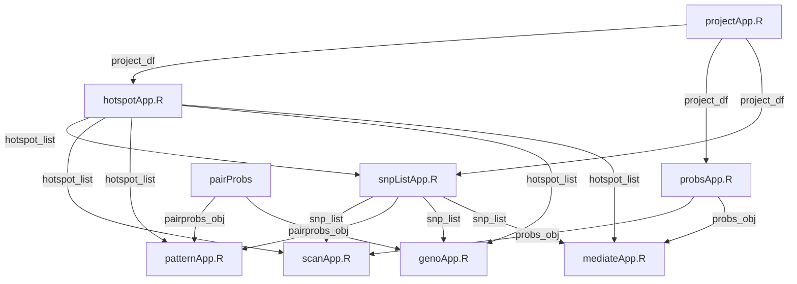

# Developer's Guide to the `qtl2shiny` Package

This directory contains developer-facing documentation for the `qtl2shiny` package. It details the architecture of the Shiny application, how data flows through the system, and how the 40+ module files (`R/*App.R`) are organized into visual panels and utility layers.
Prompts and process to create this guide are documented in
[Create Developer’s Guide to `qtl2shiny`](https://byandell.github.io/Documentation/prompts/devel_guide.html)

## Table of Contents

- [1. High-Level Architecture & Layout](#1-high-level-architecture--layout)
  - [UI Layout](#ui-layout)
  - [Module Communication](#module-communication)
  - [Download Framework (`downr` Integration)](#download-framework-downr-integration)
- [2. Analysis Panels](#2-analysis-panels)
  - [A. Hotspots & Phenotypes](#a-hotspots--phenotypes)
  - [B. Allele & SNP Scans](#b-allele--snp-scans)
  - [C. Pattern Analysis](#c-pattern-analysis)
  - [D. Genotypes](#d-genotypes)
  - [E. Mediation](#e-mediation)
- [3. Generic & Utility Modules](#3-generic--utility-modules)
- [4. Comprehensive File Mapping](#4-comprehensive-file-mapping)

### Detailed Module Guides

- [Hotspots & Phenotypes Panel (`hotspotApp`)](./hotspotApp.md)
- [Allele & SNP Scans Panel (`scanApp`)](./scanApp.md)
- [Patterns Panel (`patternApp`)](./patternApp.md)
- [Genotypes Panel (`genoApp`)](./genoApp.md)
- [Mediation Panel (`mediateApp`)](./mediateApp.md)

---

## 1. High-Level Architecture & Layout

The main entry point for the application is defined in [R/qtl2shinyApp.R](../../../R/qtl2shinyApp.R). It uses the **Bootstrap 5 (`bslib`)** framework to construct a responsive, sidebar-driven dashboard.

### UI Layout

The dashboard layout is defined in `qtl2shinyUI()`:

- **Global Sidebar**: Contains global configuration selectors loaded dynamically:
  - Project registry selection (`projectUI`)
  - Phenotype dataset class and model parameters (`hotspotInput`)
  - SNP parameters (`dipParInput`)
  - SNP and phenotype subset filters (`snpListInput`)
- **Header**: Contains the download button/dropdown widget (`downr::downloadInput`) which connects dynamically to the active panel.
- **Main Body**: Organizes the app into five major navigation tabs (`bslib::nav_panel`):
  1. **Hotspots & Phenotypes**
  2. **Allele & SNP Scans**
  3. **Patterns**
  4. **Genotypes**
  5. **Mediation**

### Module Communication

The panels communicate using reactive values passed down from parent modules or shared via returned reactive lists. The server logic in `qtl2shinyServer()` instantiates and links these modules together.

### Download Framework (`downr` Integration)

At any point, the active panel exposes a reactive list containing:

- `Plot`: A reactive expression returning the currently displayed ggplot or plotly object.
- `Table`: A reactive expression returning the currently displayed dataframe or data table.
- `Filename`: The output prefix name based on current settings (e.g. phenotype names).
- `Type`: A selector determining if the user downloads a plot, table, or has to choose.

The server observes the active tab (`input$panel`) and routes the corresponding panel's download reactive list to `downr::downloadServer("download", download_list_panel)`.

---

## 2. Analysis Panels

### A. Hotspots & Phenotypes

- **Purpose**: Allows users to load experimental projects, select phenotype datasets, run genome-wide hotspot scans, and view specific raw phenotype distributions.
- **Entrypoint**: [R/hotspotApp.R](../../../R/hotspotApp.R)
- **Constituent Modules**:
  - [R/hotspotDataApp.R](../../../R/hotspotDataApp.R): Computes the hotspot object by calculating the density of precomputed QTL peaks across chromosomes.
  - [R/hotspotPlotApp.R](../../../R/hotspotPlotApp.R): Generates plots of hotspot scans (LOD or peak count vs. genomic coordinates).
  - [R/hotspotTableApp.R](../../../R/hotspotTableApp.R): Renders a searchable data table of peaks within the selected hotspot.
  - [R/peakApp.R](../../../R/peakApp.R): Manages peak summaries filtered to the hotspot.
  - [R/peakReadApp.R](../../../R/peakReadApp.R): Performs file reading of the `peaks.rds` data file.
  - [R/phenoApp.R](../../../R/phenoApp.R): Acts as the container module for phenotype distribution panels.
  - [R/phenoReadApp.R](../../../R/phenoReadApp.R): Reads the `pheno_data.rds` matrix.
  - [R/phenoNamesApp.R](../../../R/phenoNamesApp.R): Controls selectors for phenotype name filtering.
  - [R/phenoDataApp.R](../../../R/phenoDataApp.R): Normalizes and filters phenotype values (e.g. rank-Z transformation via `rankZ()`).
  - [R/phenoTableApp.R](../../../R/phenoTableApp.R): Displays raw or normalized phenotype values.
  - [R/phenoPlotApp.R](../../../R/phenoPlotApp.R): Plots boxplots, scatterplots, or density distributions.

### B. Allele & SNP Scans

- **Purpose**: Computes and compares genome-wide scans using multi-parent allele founder coefficients versus high-density SNP association mapping.
- **Entrypoint**: [R/scanApp.R](../../../R/scanApp.R)
- **Constituent Modules**:
  - [R/scanDataApp.R](../../../R/scanDataApp.R): Computes and plots allele founder coefficients scans (LOD/BLUP curves) for selected chromosomes.
  - [R/snpGeneApp.R](../../../R/snpGeneApp.R): Top-level wrapper linking SNP tables, SNP plots, gene region overlays, and exon plots.
  - [R/snpTableApp.R](../../../R/snpTableApp.R): Lists top SNPs/variants in the region.
  - [R/snpPlotApp.R](../../../R/snpPlotApp.R): Renders the Manhattan-style SNP association LOD scan.
  - [R/geneRegionApp.R](../../../R/geneRegionApp.R): Queries gene annotation databases and draws gene models in the window.
  - [R/geneExonApp.R](../../../R/geneExonApp.R): Pulls detailed exon structures for a clicked or queried gene.

### C. Pattern Analysis

- **Purpose**: Groups high-density SNPs in a QTL region into Strain Distribution Patterns (SDPs) to narrow down candidates based on shared founder ancestral alleles.
- **Entrypoint**: [R/patternApp.R](../../../R/patternApp.R)
- **Constituent Modules**:
  - [R/snpPatternApp.R](../../../R/snpPatternApp.R): Top-level module coordinating pattern scans, features, and plotting.
  - [R/patternDataApp.R](../../../R/patternDataApp.R): Runs the underlying scan for the top SDPs and generates summaries.
  - [R/patternPlotApp.R](../../../R/patternPlotApp.R): Generates SDP scan plots comparing multiple phenotypes.
  - [R/snpFeatureApp.R](../../../R/snpFeatureApp.R): Maps variants to genomic consequences (synonymous, coding, intron, splice site, etc.) and catalogs SDP details.

### D. Genotypes

- **Purpose**: Inspects multi-point raw founder genotype probabilities, strain distribution pattern assignments, and their phenotypic effects at specific genomic locations.
- **Entrypoint**: [R/genoApp.R](../../../R/genoApp.R)
- **Constituent Modules**:
  - [R/genoDataApp.R](../../../R/genoDataApp.R): Renders genotype probabilities and SDP pairings at a chosen physical marker. For a deep-dive, see the [Genotypes Panel Guide](genoApp.md).
  - [R/genoPlotApp.R](../../../R/genoPlotApp.R): Visualizes individuals' genotype probabilities along chromosomal segments.
  - [R/genoEffectApp.R](../../../R/genoEffectApp.R): Evaluates phenotypic averages by genotype group, providing tables and plots of genetic effects.

### E. Mediation

- **Purpose**: Performs regression-based QTL mediation analysis (e.g., intermediate mRNA expression or protein abundance) to identify candidate causal drivers.
- **Entrypoint**: [R/mediateApp.R](../../../R/mediateApp.R)
- **Constituent Modules**:
  - [R/mediateDataApp.R](../../../R/mediateDataApp.R): Calls mediation libraries (`qtl2mediate`) to compute the drop in QTL LOD score when conditioning on mediators.
  - [R/mediatePlotApp.R](../../../R/mediatePlotApp.R): Visualizes mediation results (LOD drops vs. physical coordinates).
  - [R/triadApp.R](../../../R/triadApp.R): Plots individual scatterplot grids illustrating relationships among driver locus, mediator, and target phenotype.

---

## 3. Generic & Utility Modules

These modules do not represent individual analysis panels but act as shared global selectors or data managers. They are essential for feeding reactive parameters into multiple tabs:

- **[R/projectApp.R](../../../R/projectApp.R)**: Loads the initial project list from `projects.csv` and allows the user to switch between taxa, databases, and study setups.
- **[R/setParApp.R](../../../R/setParApp.R)**: Dynamically extracts study-specific parameters (such as the phenotype `class` and `subject_model`) depending on the selected project registry.
- **[R/winParApp.R](../../../R/winParApp.R)**: Tracks the active chromosomal window (Chr, Start/End Mbp) selected from a peak or hotspot table.
- **[R/dipParApp.R](../../../R/dipParApp.R)**: Manages genetic model parameters (additive vs. dominance actions, founder allele codes).
- **[R/snpListApp.R](../../../R/snpListApp.R)**: Consolidated input selector for SNP filters. It handles local coordinates, min LOD score sliders, and active phenotype selections.
- **[R/probsApp.R](../../../R/probsApp.R)**: Reactive server utility to load high-dimensional multi-point founder genotype probabilities using fast disk-backed serialization (`FST` database queries).
- **[R/kinshipApp.R](../../../R/kinshipApp.R)**: Reactively loads LOCO (Leave-One-Chromosome-Out) kinship matrix objects corresponding to the active chromosome.
- **[R/downloadApp.R](../../../R/downloadApp.R)**: Wrapper server interfacing with the `downr` external package to manage CSV exports and vector plot rendering (PNG/PDF).

---

## 4. Comprehensive File Mapping

Here is the complete mapping of all 41 `R/*App.R` files:

| File Name | Primary Tab / Area | Module Type | Key Server Function |
| :--- | :--- | :--- | :--- |
| **Main App** | | | |
| [R/qtl2shinyApp.R](../../../R/qtl2shinyApp.R) | Top-Level Coordinator | Entrypoint | `qtl2shinyServer` |
| **Hotspots & Phenotypes** | | | |
| [R/hotspotApp.R](../../../R/hotspotApp.R) | Hotspots & Phenotypes | Entrypoint Panel | `hotspotServer` |
| [R/hotspotDataApp.R](../../../R/hotspotDataApp.R) | Hotspots & Phenotypes | Integral Submodule | `hotspotDataServer` |
| [R/hotspotPlotApp.R](../../../R/hotspotPlotApp.R) | Hotspots & Phenotypes | Integral Submodule | `hotspotPlotServer` |
| [R/hotspotTableApp.R](../../../R/hotspotTableApp.R) | Hotspots & Phenotypes | Integral Submodule | `hotspotTableServer` |
| [R/peakApp.R](../../../R/peakApp.R) | Hotspots & Phenotypes | Integral Submodule | `peakServer` |
| [R/peakReadApp.R](../../../R/peakReadApp.R) | Hotspots & Phenotypes | Data Loader | `peakReadServer` |
| [R/phenoApp.R](../../../R/phenoApp.R) | Hotspots & Phenotypes | Entrypoint Subpanel | `phenoServer` |
| [R/phenoReadApp.R](../../../R/phenoReadApp.R) | Hotspots & Phenotypes | Data Loader | `phenoReadServer` |
| [R/phenoNamesApp.R](../../../R/phenoNamesApp.R) | Hotspots & Phenotypes | Selector | `phenoNamesServer` |
| [R/phenoDataApp.R](../../../R/phenoDataApp.R) | Hotspots & Phenotypes | Normalizer | `phenoDataServer` |
| [R/phenoTableApp.R](../../../R/phenoTableApp.R) | Hotspots & Phenotypes | Renders UI Table | `phenoTableServer` |
| [R/phenoPlotApp.R](../../../R/phenoPlotApp.R) | Hotspots & Phenotypes | Renders UI Plot | `phenoPlotServer` |
| **Allele & SNP Scans** | | | |
| [R/scanApp.R](../../../R/scanApp.R) | Allele & SNP Scans | Entrypoint Panel | `scanServer` |
| [R/scanDataApp.R](../../../R/scanDataApp.R) | Allele & SNP Scans | Integral Submodule | `scanDataServer` |
| [R/snpGeneApp.R](../../../R/snpGeneApp.R) | Allele & SNP Scans | Integral Subpanel | `snpGeneServer` |
| [R/snpTableApp.R](../../../R/snpTableApp.R) | Allele & SNP Scans | Integral Submodule | `snpTableServer` |
| [R/snpPlotApp.R](../../../R/snpPlotApp.R) | Allele & SNP Scans | Integral Submodule | `snpPlotServer` |
| [R/geneRegionApp.R](../../../R/geneRegionApp.R) | Allele & SNP Scans | DB Query & Plot | `geneRegionServer` |
| [R/geneExonApp.R](../../../R/geneExonApp.R) | Allele & SNP Scans | DB Query & Plot | `geneExonServer` |
| **Patterns** | | | |
| [R/patternApp.R](../../../R/patternApp.R) | Patterns | Entrypoint Panel | `patternServer` |
| [R/snpPatternApp.R](../../../R/snpPatternApp.R) | Patterns | Integral Subpanel | `snpPatternServer` |
| [R/patternDataApp.R](../../../R/patternDataApp.R) | Patterns | Integral Submodule | `patternDataServer` |
| [R/patternPlotApp.R](../../../R/patternPlotApp.R) | Patterns | Integral Submodule | `patternPlotServer` |
| [R/snpFeatureApp.R](../../../R/snpFeatureApp.R) | Patterns | Annotation Overlay | `snpFeatureServer` |
| **Genotypes** | | | |
| [R/genoApp.R](../../../R/genoApp.R) | Genotypes | Entrypoint Panel | `genoServer` |
| [R/genoDataApp.R](../../../R/genoDataApp.R) | Genotypes | Integral Submodule | `genoDataServer` |
| [R/genoPlotApp.R](../../../R/genoPlotApp.R) | Genotypes | Integral Submodule | `genoPlotServer` |
| [R/genoEffectApp.R](../../../R/genoEffectApp.R) | Genotypes | Integral Submodule | `genoEffectServer` |
| **Mediation** | | | |
| [R/mediateApp.R](../../../R/mediateApp.R) | Mediation | Entrypoint Panel | `mediateServer` |
| [R/mediateDataApp.R](../../../R/mediateDataApp.R) | Mediation | Integral Submodule | `mediateDataServer` |
| [R/mediatePlotApp.R](../../../R/mediatePlotApp.R) | Mediation | Integral Submodule | `mediatePlotServer` |
| [R/triadApp.R](../../../R/triadApp.R) | Mediation | Integral Submodule | `triadServer` |
| **Generic & Utilities** | | | |
| [R/projectApp.R](../../../R/projectApp.R) | Global Sidebar | Generic Utility | `projectServer` |
| [R/setParApp.R](../../../R/setParApp.R) | Global Sidebar | Generic Utility | `setParServer` |
| [R/winParApp.R](../../../R/winParApp.R) | Global Sidebar | Generic Utility | `winParServer` |
| [R/dipParApp.R](../../../R/dipParApp.R) | Global Sidebar | Generic Utility | `dipParServer` |
| [R/snpListApp.R](../../../R/snpListApp.R) | Global Sidebar | Generic Utility | `snpListServer` |
| [R/probsApp.R](../../../R/probsApp.R) | Data / Probs Loader | Generic Utility | `probsServer` |
| [R/kinshipApp.R](../../../R/kinshipApp.R) | Data / Kinship Loader | Generic Utility | `kinshipServer` |
| [R/downloadApp.R](../../../R/downloadApp.R) | Global Header | Generic Utility | `downloadServer` |
