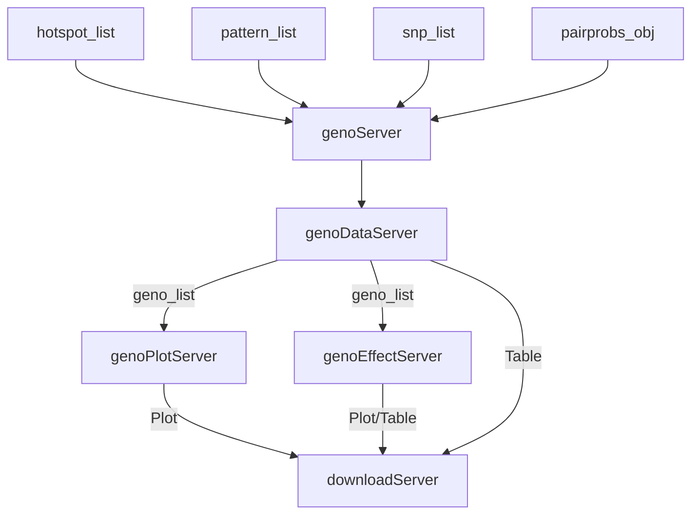
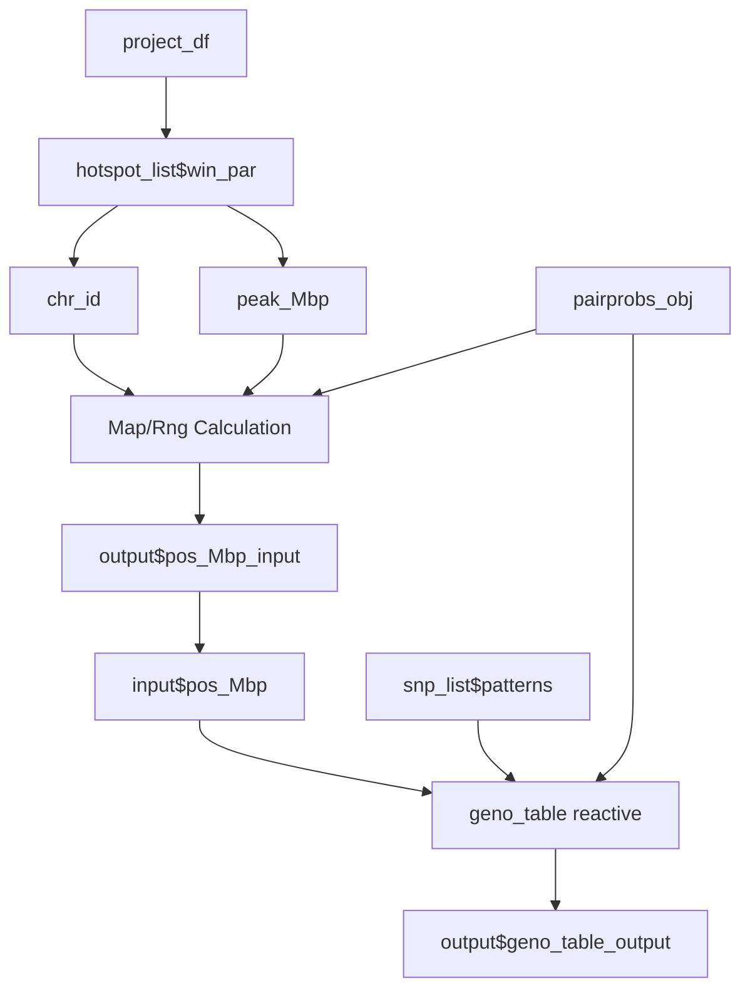

# Developer's Guide to the Genotypes Panel (`genoApp`)

## Overview

The **Genotypes** panel is a high-level visual container designed to investigate genotype probabilities, strain distribution patterns (SDPs), and phenotypic effects at specific chromosomal locations. It acts as an integration layer, coordinating three sub-modules:
1. **`genoDataApp`**: Loads and filters pairwise founder genotype probabilities.
2. **`genoPlotApp`**: Plots individual genotype probabilities along chromosomes.
3. **`genoEffectApp`**: Evaluates phenotype associations (averages/BLUPs) by genotype class or pattern.

---

### Module Hierarchy & Entrypoints

- **Top-Level Container**:
  - Standalone Application: `genoApp()`
  - Server Module: `genoServer(id, hotspot_list, pattern_list, snp_list, pairprobs_obj, project_df)`
  - UI Input: `genoInput(id)`
  - UI Output: `genoOutput(id)`

- **Sub-Modules**:
  - **Genotype Data (`genoDataApp`)**:
    - Server: `genoDataServer(id, hotspot_list, snp_list, pairprobs_obj, project_df)`
    - UI Input: `genoDataInput(id)`
    - UI Output: `genoDataOutput(id)`
  - **Genotype Plot (`genoPlotApp`)**:
    - Server: `genoPlotServer(id, hotspot_list, geno_list)`
    - UI Output: `genoPlotOutput(id)`
  - **Genotype Effect (`genoEffectApp`)**:
    - Server: `genoEffectServer(id, hotspot_list, pattern_list, snp_list, geno_list, pairprobs_obj, project_df)`
    - UI Input: `genoEffectUI(id)` (Displays Summary DataTable)
    - UI Output: `genoEffectOutput(id)` (Displays Effect Plot)

---

## 1. Top-Level Container (`genoApp`)

### Server Logic & Reactive Flow (`genoServer`)

The main server orchestrates parameters from global sidebars (`hotspot_list`, `pattern_list`, `snp_list`) and routes coordinates from the data submodule to the plot and effect panels:

1. **Instantiation**:
   - Calls `genoDataServer` to create the positional coordinate reactive (`pos_Mbp`) and the main genotype probabilities table.
   - Passes the resulting `geno_list` to `genoPlotServer` and `genoEffectServer`.
2. **Download Handling**:
   - Renders download handlers (`download_Plot`, `download_Table`, `download_Filename`, `download_Type`) depending on which tab panel is active:
     - `Genotypes` / `GenoTable`: Downloads plots/tables from `genoPlotServer` / `genoDataServer`.
     - `Effects` / `EffectTable`: Downloads plots/tables from `genoEffectServer`.



---

## 2. Genotype Data Module (`genoDataApp`)

`genoDataApp()` is a module designed to retrieve, filter, and format pairwise genotype probability tables (`geno_table`) for a selected chromosomal region, strain distribution patterns (SDPs), and physical map positions (Mbp).

### Data Used by the Module
- **Genotype Probabilities (`genoprob/` directory / FST format)**: 36-state (or collapsed 8-state) genotype probabilities.
- **Physical Map (`pmap.rds`)**: Map of markers and physical coordinates.
- **Strain Distribution Patterns**: Alleles mapping founder lines to distinct strain distribution groups (from `snp_list$patterns`).

### Logic and Code Workflow



1. **Parameters & Coordinate Selection**:
   - Extracts `chr_id` and `peak_Mbp` from `hotspot_list$win_par`.
   - Renders a slider selector `pos_Mbp` dynamically inside `output$pos_Mbp_input` mapped to the chromosome physical map boundaries.
   - Observes resets to update slider values when chromosome selection changes:
     ```r
     observeEvent(shiny::req(win_par()), {
       if (shiny::isTruthy(input$pos_Mbp)) {
         map <- shiny::req(pairprobs_obj()$map)
         chr <- shiny::req(chr_id())
         rng <- round(2 * range(map[[chr]])) / 2
         value <- shiny::req(peak_Mbp())
         if(value < rng[1] | value > rng[2]) value <- mean(rng)
         shiny::updateSliderInput(session, "pos_Mbp", NULL, value, rng[1], rng[2], step=.1)
       }
     })
     ```
2. **Genotype Table Calculation**:
   - Computes `geno_table` reactively using `qtl2pattern::pair_geno_table()` at the current coordinate.
3. **Data Table Output**:
   - Renders a searchable data table in `output$geno_table_output` using `DT::renderDataTable`.
4. **Return Structure**:
   - `pos_Mbp`: Current slider coordinate reactive.
   - `Table`: Computed genotype table reactive.

---

## 3. Genotype Plot Module (`genoPlotApp`)

`genoPlotApp` visualizes individual genotype probabilities along chromosomes to help developers and researchers examine founder ancestry.

### Data Used by the Module
- **Phenotype Matrix (`pheno_mx`)**: Passed reactively from `hotspot_list$pheno_mx`.
- **Genotype Table (`geno_table`)**: Passed reactively from `geno_list$Table`.

### Logic and Code Workflow
- **`geno_plot`**: Computes the ggplot object reactively by calling `geno_ggplot` from the `qtl2pattern` package, passing the active genotypes table and phenotype matrix:
  ```r
  geno_plot <- shiny::reactive({
    geno_ggplot(shiny::req(geno_table()), shiny::req(pheno_mx()))
  })
  ```
- **Rendering**: Outputs the ggplot object in `output$geno_plot` using `shiny::renderPlot`.

---

## 4. Genotype Effect Module (`genoEffectApp`)

`genoEffectApp` models and visualizes phenotypic effects by grouping experimental individuals according to their genotype probabilities and patterns at the selected locus.

### Data Used by the Module
- **Genotype Probabilities (`pairprobs_obj`)**
- **Phenotypes (`pheno_mx`)**: Selected phenotype column.
- **Covariates & Kinship**: `covar_df` and LOCO `kinship_list` for statistical regression.
- **Strain Distribution Patterns & Scans**: `patterns()` and `scan_pattern()` from the pattern module (retaining BLUP attributes).

### Logic and Code Workflow

1. **Effect Scanning (`effect_obj`)**:
   - Executes the statistical scan by running `effect_scan()` when genotypes, phenotypes, and patterns become valid:
     ```r
     effect_obj <- shiny::reactive({
       shiny::req(snp_action(), project_df(), pairprobs_obj(),
                  hotspot_list$kinship_list(), hotspot_list$covar_df(),
                  hotspot_list$peak_df(), pattern_list$scan_pattern())
       pheno_name <- shiny::req(pattern_list$pat_par$pheno_name)
       pheno_mx <- shiny::req(hotspot_list$pheno_mx())[, pheno_name, drop = FALSE]
       blups <- attr(pattern_list$scan_pattern(), "blups")
       
       appProgress('Effect scans', pheno_name, {
         shiny::setProgress(1)
         effect_scan(pheno_mx, hotspot_list$covar_df(),
                     pairprobs_obj(), hotspot_list$kinship_list(),
                     hotspot_list$peak_df(), patterns(),
                     pattern_list$scan_pattern(), blups)
       })
     })
     ```
2. **Visualizing Effects (`geno_effect_plot`)**:
   - Generates the ggplot object by calling `ggplot2::autoplot()` on the effect scan object at the chosen physical position `pos_Mbp()`:
     ```r
     p <- ggplot2::autoplot(eff, pos = pos_Mbp())
     p + ggplot2::ggtitle(colnames(hotspot_list$pheno_mx()))
     ```
3. **Summary Table (`geno_effect_table`)**:
   - Summarizes effect estimates at `pos_Mbp()` by calling `effect_summary(eff, pos = pos_Mbp())`.
   - Renders the summary in `output$geno_effect_table_output` using `DT::renderDataTable`.
