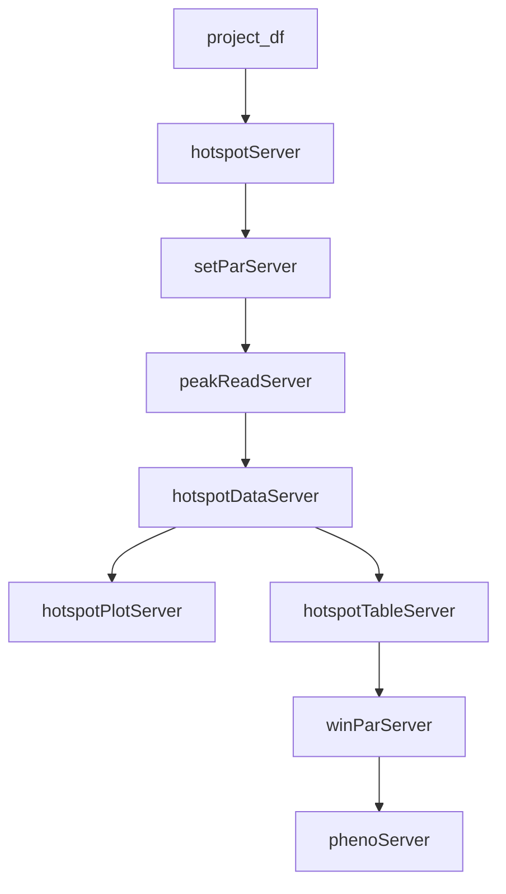

# Developer's Guide to the Hotspots & Phenotypes Panel (`hotspotApp`)

*[Developer's Guide to the `qtl2shiny` Package](./)*

## Overview

The **Hotspots & Phenotypes** panel is the entry point for data exploration in the `qtl2shiny` application. It allows researchers to load experimental datasets, view precomputed QTL peak densities (genomic hotspots), and explore the statistical distributions of raw and normalized phenotype variables.

It coordinates two primary sub-panel structures:

1. **Hotspot Analysis Sub-Panel**: Deals with peaks filtering, chromosomal density computations, and coordinate window selections.
2. **Phenotypes Sub-Panel**: Handles the loading, filtering, normalization, and graphical plotting of phenotype records.

---

### Module Hierarchy & Entrypoints

- **Top-Level Container**:
  - Standalone Application: `hotspotApp()`
  - Server Module: `hotspotServer(id, project_df, main_par)`
  - UI Input: `hotspotInput(id)`
  - UI Output: `hotspotOutput(id)`

- **Hotspot Sub-Modules**:
  - **Hotspot Data (`hotspotDataApp`)**: Computes peak count densities. Server: `hotspotDataServer`.
  - **Hotspot Table (`hotspotTableApp`)**: Searchable peaks/hotspots datatable. Server: `hotspotTableServer`.
  - **Hotspot Plot (`hotspotPlotApp`)**: Density plots of QTL peaks. Server: `hotspotPlotServer`.
  - **Peaks Filter (`peakApp` / `peakReadApp`)**: Handles reading/filtering of precomputed peak files. Server: `peakServer` / `peakReadServer`.

- **Phenotype Sub-Modules**:
  - **Phenotypes Container (`phenoApp`)**: Server: `phenoServer`.
  - **Pheno Reader (`phenoReadApp`)**: Reads raw database matrix. Server: `phenoReadServer`.
  - **Pheno Names Selector (`phenoNamesApp`)**: Filter inputs. Server: `phenoNamesServer`.
  - **Pheno Data Normalizer (`phenoDataApp`)**: Runs transformations (e.g., `rankZ()`). Server: `phenoDataServer`.
  - **Pheno Table (`phenoTableApp`)**: Renders data tables. Server: `phenoTableServer`.
  - **Pheno Plot (`phenoPlotApp`)**: Renders boxplots/scatterplots. Server: `phenoPlotServer`.

---

## 1. Top-Level Container (`hotspotApp`)

### Server Logic & Reactive Flow (`hotspotServer`)

The master server integrates study parameters (`set_par`), physical maps (`pmap_obj`), and handles active-tab downroute downloads:

1. **Parameter Initializers**:
   - Spawns `setParServer` and loads `pmap_obj` using `read_project()`.
2. **Analysis Pipelines**:
   - Calls `hotspotDataServer()` to compute active QTL hotspots.
   - Passes hotspot coordinates to `winParServer` to register the active chromosomal window (`win_par`).
   - Passes coordinates to `phenoServer()` to query associated phenotypes in the window.
3. **Dynamic Downloads**:
   - Directs plot/table downloads to `downr::downloadServer` by tracking the active sub-tab:
     - `Hotspots` tab: Routes plots/tables from `hotspotPlotServer` and `hotspotTableServer`.
     - `Phenotypes` tab: Routes plots/tables from `phenoPlotServer` and `phenoTableServer`.

---

## 2. Hotspot Density Scans (`hotspotDataApp` & Sub-modules)

### Data Used

- **`peaks.rds`**: A precomputed dataframe listing LOD scores, marker names, and Mbp positions of QTL peaks.
- **`pmap.rds`**: The physical map of markers and Mbp locations.

### Logic and Code Workflow

1. **Hotspot Densities Calculation**:
   - `hotspotDataServer` scans precomputed peaks across the genome. It determines the number of peaks exceeding a lod threshold within moving chromosomal windows.
2. **Visualizing Hotspots (`hotspotPlotServer`)**:
   - Generates genome-wide peak count or LOD density charts.
3. **Coordinates Selection (`winParServer`)**:
   - Evaluates user clicks or selections on the hotspots data table/plots to update the active chromosomal range (`chr_id`, `start_Mbp`, `end_Mbp`).

---

## 3. Phenotype Distributions (`phenoApp` & Sub-modules)

### Data Used

- **`pheno_data.rds`**: A matrix storing raw measurements (rows = individuals, columns = phenotypes).
- **`covar.rds`**: Covariates data frame (e.g. sex, age, batch) for adjusting phenotype averages.

### Logic and Code Workflow

1. **Filtering & Loading**:
   - `phenoReadServer` reads the `pheno_data.rds` file relative to the selected project.
   - `phenoNamesServer` lists available phenotype parameters.
2. **Normalizations (`phenoDataServer`)**:
   - Normalizes selected phenotype distributions on-the-fly (e.g., using rank-based normal transformations via `rankZ()`).
3. **Plotting (`phenoPlotServer`)**:
   - Renders individual density curves, boxplots grouped by cohort parameters, or multi-phenotype scatterplot grids.
