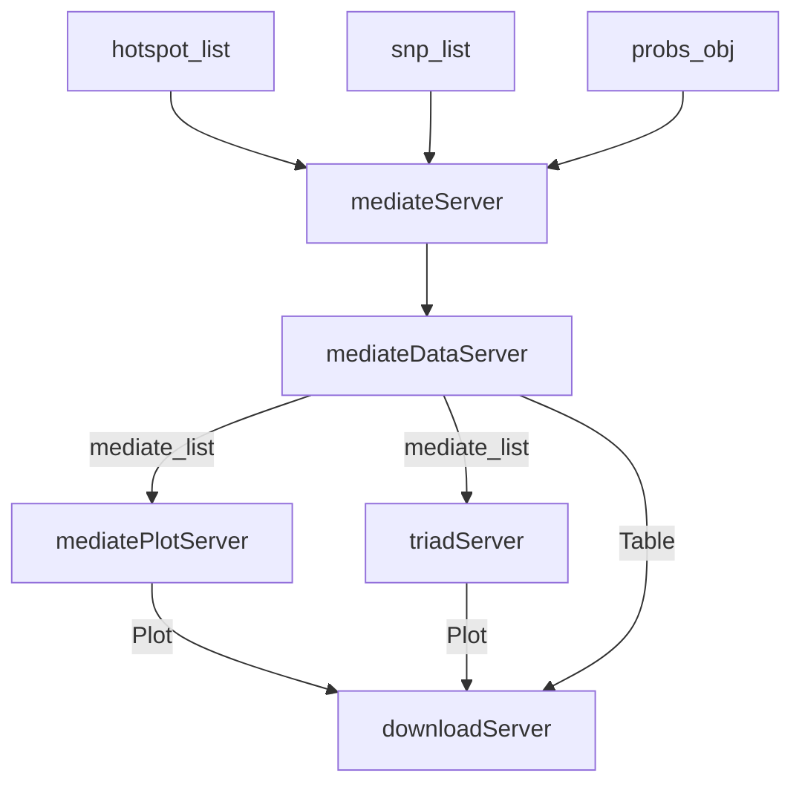

# Developer's Guide to the Mediation Panel (`mediateApp`)

*[Developer's Guide to the `qtl2shiny` Package](./)*

## Overview

The **Mediation** panel performs causal inference to identify intermediate variables (e.g. mRNA transcript expression, protein abundance) that mediate the path between a genomic QTL driver locus and a downstream target clinical phenotype.

It integrates:

1. **`mediateDataApp`**: Computes regression models to measure how conditioning on candidates drops the QTL LOD score.
2. **`mediatePlotApp`**: Visualizes LOD drop profiles along chromosomes.
3. **`triadApp`**: Renders scatterplot matrices of the Driver-Mediator-Trait triad.

---

### Module Hierarchy & Entrypoints

- **Top-Level Container**:
  - Standalone Application: `mediateApp()`
  - Server Module: `mediateServer(id, hotspot_list, snp_list, probs_obj, project_df)`
  - UI Input: `mediateInput(id)`
  - UI Output: `mediateOutput(id)`

- **Sub-Modules**:
  - **Mediation Data (`mediateDataApp`)**: Computes mediation regression models. Server: `mediateDataServer`.
  - **Mediation Plot (`mediatePlotApp`)**: Plots mediation drop profiles. Server: `mediatePlotServer`.
  - **Triad Scatterplot (`triadApp`)**: Draws triad relationship grids. Server: `triadServer`.

---

## 1. Top-Level Container (`mediateApp`)

### Server Logic & Reactive Flow (`mediateServer`)

The master mediation server instantiates the analysis pipeline, renders input selectors depending on the active tab, and structures the download reactives:

1. **Instantiation**:
   - Calls `mediateDataServer` to handle regressions.
   - Passes the resulting `mediate_list` to `mediatePlotServer` and `triadServer`.
2. **Dynamic UI Rendering**:
   - Dynamically renders input panels (`mediate_input` UI element) depending on tab clicks:
     - `Plot` tab: Displays mediation plot settings (static vs interactive, local vs distant candidates).
     - `Triad` tab: Displays triad dropdowns to select candidate mediators.
3. **Download Routing**:
   - Directs downloads to `downr` depending on tab selection:
     - `Summary` / `Plot` tab: Routes plots/tables from `mediatePlotServer` and the best-mediator table from `mediateDataServer`.
     - `Triad` tab: Routes scatterplot grids from `triadServer`.

---

## 2. Mediation Regressions & Plotting (`mediateDataApp` & `mediatePlotApp`)

### Data Used

- **Mediator Expressional Matrix**: Expression or abundance records.
- **Genotype Probabilities (`probs_obj`)**: Disk-backed multi-point probabilities.
- **LOCO Kinship & Covariates**: `hotspot_list$kinship_list` and `hotspot_list$covar_df`.

### Logic and Code Workflow

1. **Mediation Calculations**:
   - `mediateDataServer` runs `qtl2mediate::mediate1()` to evaluate candidates. It calculates:
     - Target phenotype LOD score.
     - Target LOD score conditioned on the candidate mediator.
     - LOD drop (original LOD - conditioned LOD).
2. **Drop Plotting (`mediatePlotServer`)**:
   - Generates scatterplots mapping candidate gene physical coordinates (X-axis) against their conditioned LOD values (Y-axis). Candidates causing a significant LOD drop are highlighted.

---

## 3. Triad Scatterplots (`triadApp`)

### Data Used

- **Genotypes (Driver)**: Allele probabilities at the target locus.
- **Mediator Expression**: Candidate intermediate profile values.
- **Target Phenotype**: Clinical record observations.

### Logic and Code Workflow

1. **Grid Generation**:
   - Groups individuals by ancestral founder alleles.
   - Plots pairwise comparisons:
     - Locus Genotype vs. Mediator Expression.
     - Mediator Expression vs. Target Phenotype.
     - Locus Genotype vs. Target Phenotype.
2. **Visualizations**:
   - Renders a multi-panel plot grid to visually assess regression linearity, covariance, and potential feedback directions.
