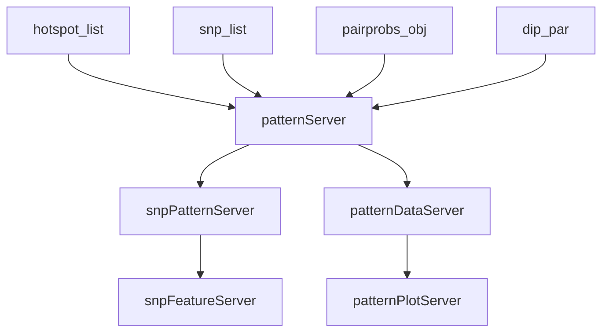

# Developer's Guide to the Patterns Panel (`patternApp`)

## Overview

The **Patterns** panel allows developers and researchers to analyze Strain Distribution Patterns (SDPs) in candidate QTL regions. By grouping SNPs according to how alleles are distributed among founder strains, researchers can identify causal variants and filter out non-associating SDP configurations.

It coordinates three primary sub-modules:
1. **`snpPatternApp`**: Explores SNP patterns and annotates variant consequences.
2. **`patternDataApp`**: Formats and computes patterns LOD scans.
3. **`patternPlotApp`**: Visualizes pattern association profiles across multiple phenotypes.

---

### Module Hierarchy & Entrypoints

- **Top-Level Container**:
  - Standalone Application: `patternApp()`
  - Server Module: `patternServer(id, dip_par, hotspot_list, snp_list, pairprobs_obj, project_df)`
  - UI Input: `patternInput(id)`
  - UI Output: `patternOutput(id)`

- **Sub-Modules**:
  - **SNP Pattern (`snpPatternApp`)**: Coordinates pattern list rendering. Server: `snpPatternServer`.
  - **SNP Feature (`snpFeatureApp`)**: Explores molecular consequences (synonymous, intron, coding). Server: `snpFeatureServer`.
  - **Pattern Data (`patternDataApp`)**: Computes SDP scan summaries. Server: `patternDataServer`.
  - **Pattern Plot (`patternPlotApp`)**: Renders SDP scan plots. Server: `patternPlotServer`.

---

## 1. Top-Level Container (`patternApp`)

### Server Logic & Reactive Flow (`patternServer`)

The main pattern server maps user selections, invokes sub-modules, and packages download responses:

1. **Instantiation**:
   - Calls `snpPatternServer` to list and filter SNP configurations.
   - Calls `patternDataServer` to execute the SDP scan regressions.
   - Passes the scans to `patternPlotServer` to draw comparison charts.
2. **Download Handling**:
   - Routes downloads using `input$pat_tab`:
     - `SNP` tab: Downloads SNP plots/tables from `snpPatternServer`.
     - `SDP` tab: Downloads pattern scans plots/tables from `patternPlotServer` and `patternDataServer`.

---

## 2. SNP Patterns & Consequences (`snpPatternApp` & `snpFeatureApp`)

### Data Used
- **SNP/Variants DB (`cc-variants.sqlite`)**: To query coordinates, strain patterns, and alleles.
- **Gene Annotations DB (`mouse_genes_mgi.sqlite`)**: To map SNP coordinates to transcript components (exons, introns, UTRs).

### Logic and Code Workflow
1. **SNP Pattern Filtering**:
   - Collapses founder alleles into a binary strain distribution representation (e.g. `00110011` for a 8-parent cross).
2. **Feature Mapping (`snpFeatureServer`)**:
   - Matches SNP coordinates with transcript profiles to annotate variant types (e.g., synonymous coding variant vs. missense vs. splice donor site).

---

## 3. SDP Scans (`patternDataApp` & `patternPlotApp`)

### Data Used
- **Pairwise Genotype Probabilities (`pairprobs_obj`)**: Disk-backed 36-state pairings loaded via `pairProbsServer`.
- **LOCO Kinship Matrices**: LOCO kinship structures.
- **Phenotypes & Covariates**: Multi-phenotype matrices.

### Logic and Code Workflow
1. **SDP Scanning (`patternDataServer`)**:
   - Collapses 36-state genotype probabilities at each chromosomal locus into specific binary SDP structures.
   - Runs linear regression scans to compute LOD scores associated with each pattern.
2. **Pattern Plotting (`patternPlotServer`)**:
   - Generates line plots comparing LOD curves across different phenotypes for the top SDPs to locate shared peaks.
