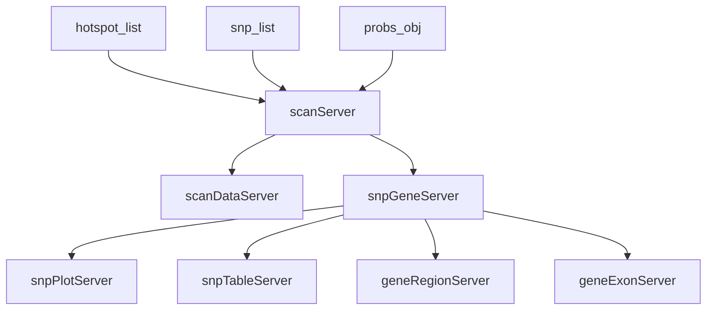

# Developer's Guide to the Allele & SNP Scans Panel (`scanApp`)

## Overview

The **Allele & SNP Scans** panel helps researchers run genome scans to identify QTL signals and overlay high-density variant mappings to narrow down candidate genes. It integrates:
1. **`scanDataApp`**: Generates founder-allele-based genome scans (LOD and BLUP curves).
2. **`snpGeneApp`**: Performs high-density SNP association scans, annotations, and gene/exon coordinate views.

---

### Module Hierarchy & Entrypoints

- **Top-Level Container**:
  - Standalone Application: `scanApp()`
  - Server Module: `scanServer(id, hotspot_list, snp_list, probs_obj, project_df)`
  - UI Input: `scanInput(id)`
  - UI Output: `scanOutput(id)`

- **Allele Scan Sub-Modules**:
  - **Allele Scan Data (`scanDataApp`)**: Computes and plots allele LOD/BLUP scans. Server: `scanDataServer`.

- **SNP & Gene Sub-Modules**:
  - **SNP/Gene Subpanel (`snpGeneApp`)**: Server: `snpGeneServer`.
  - **SNP Plot (`snpPlotApp`)**: Renders Manhattan SNP plots. Server: `snpPlotServer`.
  - **SNP Table (`snpTableApp`)**: Searchable variants datatable. Server: `snpTableServer`.
  - **Gene region (`geneRegionApp`)**: Displays gene tracks. Server: `geneRegionServer`.
  - **Exon detail (`geneExonApp`)**: Exon structure database lookup. Server: `geneExonServer`.

---

## 1. Top-Level Container (`scanApp`)

### Server Logic & Reactive Flow (`scanServer`)

The panel coordinates coordinates from the `hotspot_list$win_par` global sidebar, queries allele coefficients, and handles download outputs:

1. **Instantiation**:
   - Calls `scanDataServer` to handle founder allele calculations.
   - Calls `snpGeneServer` to coordinate high-density associations and gene annotation overlays.
2. **Download Handling**:
   - Routes plot/table downloads by checking `input$hap_tab`:
     - `scan`: Downloads plots/tables of allele-based genome scans.
     - `snp`: Downloads SNP plots, tables, gene maps, or exon charts.

---

## 2. Allele Genome Scans (`scanDataApp`)

### Data Used
- **Genotype Probabilities (`probs_obj`)**: disk-backed multi-point probabilities loaded via `probsServer`.
- **LOCO Kinship Matrices**: kinship objects corresponding to the active chromosome (`hotspot_list$kinship_list`).
- **Phenotypes & Covariates**: `hotspot_list$pheno_mx` and `hotspot_list$covar_df`.

### Logic and Code Workflow
1. **QTL Scanning**:
   - Computes QTL genome scans using `qtl2::scan1()` for the selected phenotype, accounting for covariates and kinship models.
2. **Founder BLUPs/Coefficients**:
   - Runs linear regression mapping founder coefficients along chromosomes to show direction and magnitude of effects.
3. **Plotting**:
   - Renders LOD or BLUP curves.

---

## 3. SNP Association & Gene Mapping (`snpGeneApp` & Sub-modules)

### Data Used
- **SNP Probabilities SQLite DB (`cc-variants.sqlite`)**: High-density variants query function (`query_variants`).
- **Gene Annotation SQLite DB (`mouse_genes_mgi.sqlite`)**: Database listing gene boundaries (`query_genes`).

### Logic and Code Workflow
1. **SNP Scan & Association**:
   - Collaborates with `snpListServer` which collapses founder probabilities into SNP patterns (`snpprob_collapse`).
   - Runs fast association mappings (`scan1covar`) to calculate SNP LOD scores.
2. **Manhattan Plots (`snpPlotServer`)**:
   - Plots SNP LOD scores vs. coordinates in Mbp.
3. **Gene Overlay (`geneRegionServer`)**:
   - Queries `query_genes` and maps structural genes inside the chromosomal window.
4. **Exon Structure (`geneExonApp`)**:
   - Evaluates user clicks on candidate genes to pull transcript profiles, mapping coding/non-coding exons.
