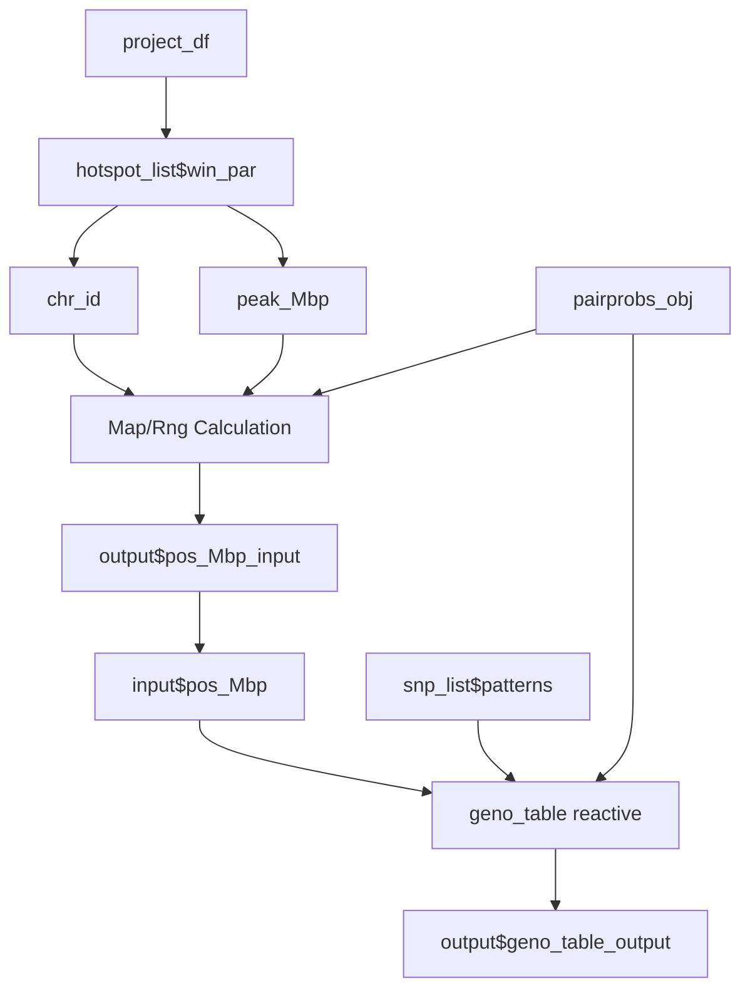

# Developer's Guide to `genoDataApp()`

## Overview
`genoDataApp()` is a standalone Shiny application and module designed to retrieve, filter, and format pairwise genotype probability tables (`geno_table`) for a selected chromosomal region, strain distribution patterns (SDPs), and physical map positions (Mbp). It acts as a bridge between structural variation probabilities and downstream phenotype association plots.

- **Standalone Entrypoint**: `genoDataApp()`
- **Server Module**: `genoDataServer(id, hotspot_list, snp_list, pairprobs_obj, project_df)`
- **UI Input Elements**: `genoDataInput(id)`
- **UI Output Display**: `genoDataOutput(id)`

---

## 1. Data Used by the Module

The module operates on specific RDS files and SQLite databases loaded under the project registry (`projects.csv`). In the context of a project (e.g., `Recla` under taxa `CCmouse`):

- **Genotype Probabilities (`genoprob/` directory / FST format)**: High-dimensional multi-point 36-state (or collapsed 8-state) genotype probabilities for individuals across chromosomes.
- **Physical Map (`pmap.rds`)**: Named lists of physical markers and their chromosomal positions in Mbp.
- **SNP/Variant Queries (`query_variants.rds` / `cc_variants.sqlite`)**: Functional RDS/SQLite databases used to map physical coordinates to variants and strain distribution patterns.
- **Strain Distribution Patterns (SDP/Patterns)**: The strain patterns identified inside the peak window mapping alleles/founder lines to distinct groups (determined by the upstream `snpList` / `patterns` module).

---

## 2. Logic and Code Workflow

The logic workflow is organized across a chain of reactive expressions, structured defensively to prevent cascading validation aborts if inputs become unbound:



### Server Logic Workflow (`genoDataServer`)

1. **Parameters & Coordinate Selection**:
   - **`chr_id`** and **`peak_Mbp`**: Isolated reactively from the selected peak in `hotspot_list$win_par`.
   - **Physical Coordinate Slider (`pos_Mbp`)**: Rendered dynamically in `output$pos_Mbp_input` by fetching the local chromosomal physical map from `pairprobs_obj()$map[[chr_id]]` and setting the default slider range.
   - **Defensive Reset Observer**:
     If `win_par` (chromosome selection) changes, an observer resets the slider value to prevent calling queries using out-of-bound or stale physical map values:
     ```r
     observeEvent(shiny::req(win_par()), {
       if (shiny::isTruthy(input$pos_Mbp)) {
         map <- shiny::req(pairprobs_obj()$map)
         chr <- shiny::req(chr_id())
         rng <- round(2 * range(map[[chr]])) / 2
         value <- shiny::req(peak_Mbp())
         if(value < rng[1] | value > rng[2]) value <- mean(rng)
         shiny::updateSliderInput(session, "pos_Mbp", NULL, value, rng[1], rng[2], step=.1)
       }
     })
     ```

2. **Genotype Table Calculation**:
   - **`geno_table`**: Triggered when `patterns()`, `pairprobs_obj()`, and `input$pos_Mbp` are all valid (`isTruthy`). It uses the helper function `pair_geno_table` from the `qtl2pattern` package to pull the pairwise genotype values at the current position.
   ```r
   geno_table <- shiny::reactive({
     shiny::req(patterns(), pairprobs_obj(), input$pos_Mbp)
     shiny::withProgress(message = 'Genotypes ...', value = 0, {
       shiny::setProgress(1)
       pair_geno_table(pairprobs_obj(), patterns(), input$pos_Mbp)
     })
   })
   ```

3. **Data Table Output**:
   - **`output$geno_table_output`**: Renders `geno_table` inside a client-side search-friendly datatable using `DT::renderDataTable`.

4. **Return Structure**:
   The module returns a reactive list to other analysis panels (e.g. `genoEffectServer`):
   - `pos_Mbp`: The current slider coordinate reactive (`reactive(input$pos_Mbp)`).
   - `Table`: The computed genotype table reactive.

---

## 3. UI Components

### UI Input (`genoDataInput`)
Dynamically displays the positional coordinate slider (`pos_Mbp_input`).
```r
genoDataInput <- function(id) {
  ns <- shiny::NS(id)
  shiny::uiOutput(ns("pos_Mbp_input"))
}
```

### UI Output (`genoDataOutput`)
Displays the structured genotypes datatable under a "Summary" tab.
```r
genoDataOutput <- function(id) {
  ns <- shiny::NS(id)
  bslib::navset_tab(
    id = "all_tab",
    bslib::nav_panel("Summary", DT::dataTableOutput(ns("geno_table_output")))
  )
}
```
